# GDPR & Data Protection Implementation Guide

## Overview

This module implements compliance with **GDPR (General Data Protection Regulation)** and the **Kenya Data Protection Act 2019 (DPA)**. It handles user consent, data encryption, data portability (export), right to erasure (anonymization), security breach notifications, and comprehensive audit logging.

## Architecture

### Module Structure

```text
apps/client/app/
├── lib/
│   ├── gdpr/
│   │   ├── services/                    # Core business logic
│   │   │   ├── compliance.service.ts    # Audit logging & reporting
│   │   │   ├── consent.service.ts       # Consent management
│   │   │   ├── anonymization.service.ts # Right to erasure
│   │   │   ├── asset-cleanup.service.ts # Asset lifecycle management
│   │   │   └── export.service.ts        # Data export orchestration
│   │   ├── encryption/                  # Field-level encryption
│   │   │   ├── field-encryption.ts      # AES-256-GCM utilities
│   │   │   └── prisma-extension.ts      # Transparent encryption middleware
│   │   └── README.md                    # This file
│   ├── queues/                          # BullMQ job queues
│   │   ├── redis-connection.ts          # Shared Redis connection
│   │   ├── export.queue.ts              # Export job definitions
│   │   └── compliance.queue.ts          # Incident & notification queues
│   └── notifications/                   # Email & SMS services
│       ├── email.service.ts             # Email templates & sending
│       ├── sms.service.ts               # SMS templates & sending
│       └── index.ts
├── workers/                             # Background job processors
│   ├── export/
│   │   ├── index.ts                     # Module exports
│   │   ├── worker.ts                    # BullMQ worker wrapper
│   │   └── processor.ts                 # Core export business logic
│   └── compliance/
│       ├── incident.worker.ts           # Security incident response
│       └── notification.worker.ts       # Batch user notifications
└── jobs/
    └── export-cleanup.ts                # CRON job for expired exports
```

### Service Dependencies

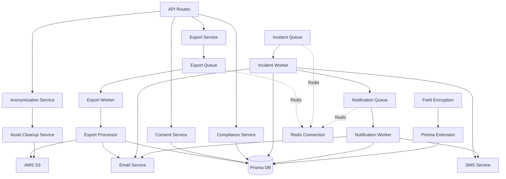

---

## 1. Consent Management

**Goal**: Granular tracking of user consent for lawful compliance (GDPR Art. 7, DPA Section 30).

### Happy Path Sequence

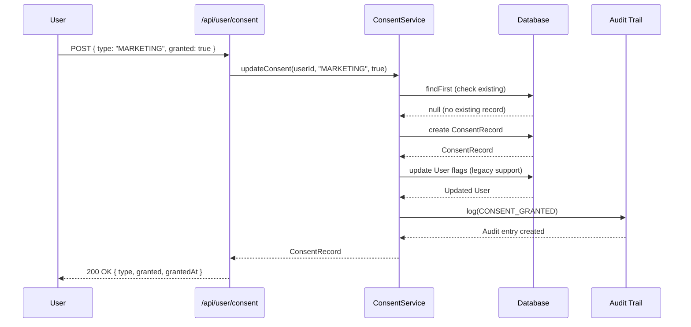

### Error Path Sequence

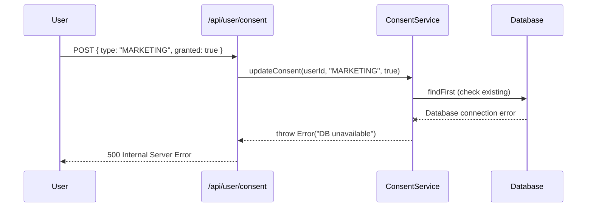

### API Reference

#### `GET /api/user/consent`

Retrieves all active consent records for the authenticated user.

**Response**:

```json
[
  {
    "id": "consent_123",
    "type": "MARKETING_EMAIL",
    "granted": true,
    "grantedAt": "2024-01-29T10:00:00Z",
    "revokedAt": null,
    "version": "v1.0",
    "metadata": {}
  }
]
```

#### `POST /api/user/consent`

Updates a specific consent preference.

**Request**:

```json
{
  "type": "MARKETING_EMAIL",
  "granted": true,
  "version": "v1.2"
}
```

**Implementation**: [lib/gdpr/services/consent.service.ts](services/consent.service.ts)

---

## 2. Data Portability (Data Export)

**Goal**: Allow users to download their personal data (GDPR Art. 20, DPA Section 39).

### Happy Path: Complete Export Lifecycle

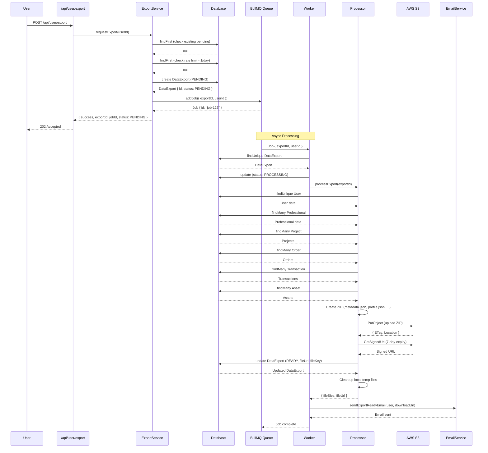

### Error Path: S3 Upload Failure

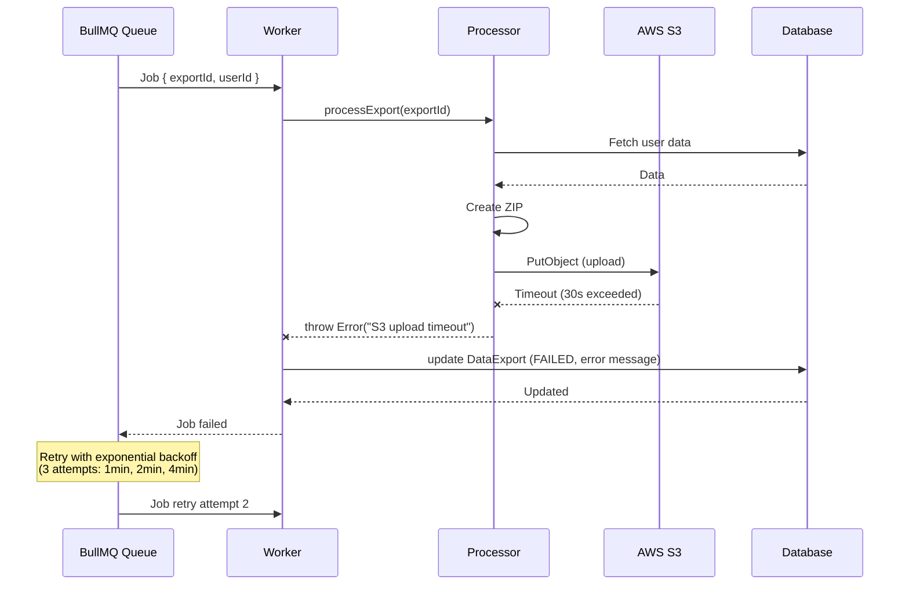

### API Reference: Data Export

#### `POST /api/user/export`

Initiates a data export request.

**Rate Limiting**: 1 export per user per 24 hours.

**Response**:

```json
{
  "success": true,
  "exportId": "export_abc123",
  "status": "PENDING",
  "message": "Your data export is being prepared. You will receive an email when ready.",
  "jobId": "job_xyz789"
}
```

#### `GET /api/user/export/:id`

Checks the status of an export request.

**Response**:

```json
{
  "id": "export_abc123",
  "status": "READY",
  "fileUrl": "https://s3.amazonaws.com/...",
  "fileSize": 1048576,
  "requestedAt": "2024-01-29T10:00:00Z",
  "expiresAt": "2024-02-05T10:00:00Z",
  "downloadedAt": null
}
```

**Statuses**: `PENDING` | `PROCESSING` | `READY` | `EXPIRED` | `FAILED` | `CANCELLED`

**Implementation**: [lib/gdpr/services/export.service.ts](services/export.service.ts) + [workers/export/](../../workers/export/)

---

## 3. Right to Erasure (Anonymization)

**Goal**: Implement user deletion with legal safeguards (GDPR Art. 17, DPA Section 38).

### 3-Phase Deletion Process

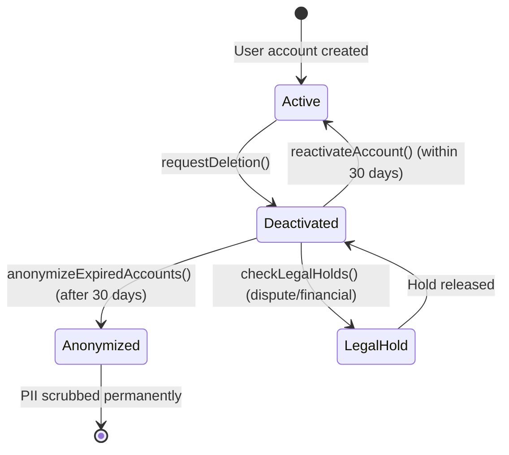

### Happy Path: Complete Anonymization Workflow

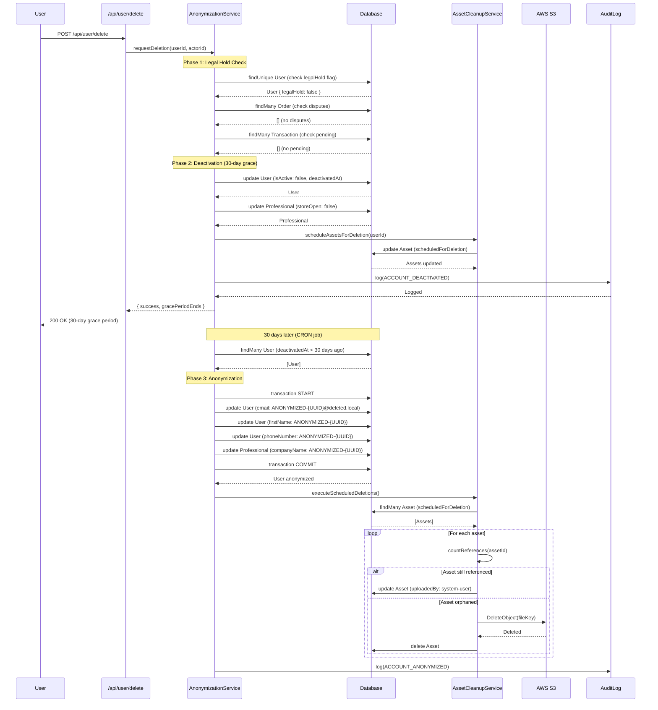

### Error Path: Legal Hold Blocks Deletion

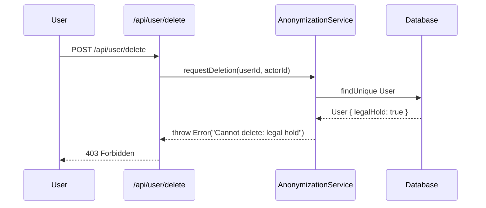

### API Reference: User Deletion

#### `POST /api/user/deletion`

Request account deletion (starts 30-day grace period).

**Response**:

```json
{
  "success": true,
  "gracePeriodEnds": "2024-02-29T10:00:00Z",
  "message": "Your account has been deactivated. You have 30 days to reactivate."
}
```

#### `POST /api/user/reactivate`

Cancel deletion within grace period.

**Response**:

```json
{
  "success": true,
  "message": "Your account has been reactivated."
}
```

**Implementation**: [lib/gdpr/services/anonymization.service.ts](services/anonymization.service.ts) + [lib/gdpr/services/asset-cleanup.service.ts](services/asset-cleanup.service.ts)

---

## 4. Security Breach Notifications

**Goal**: Comply with 72-hour breach notification requirement (GDPR Art. 33-34, DPA Section 43).

### Critical Incident Response Workflow

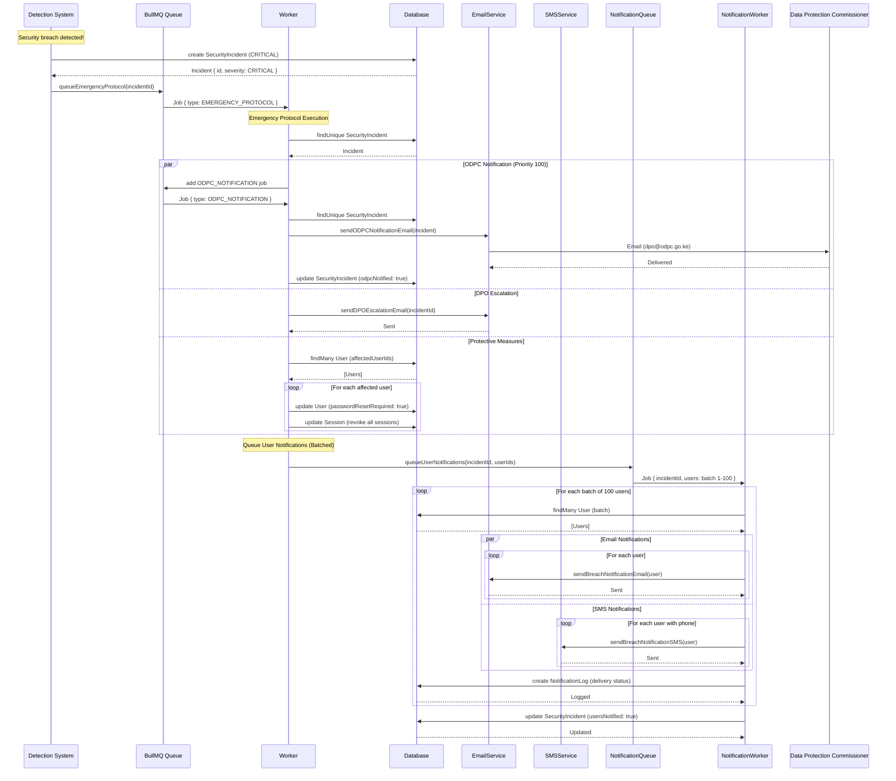

### Error Path: Email Delivery Failure with Retry

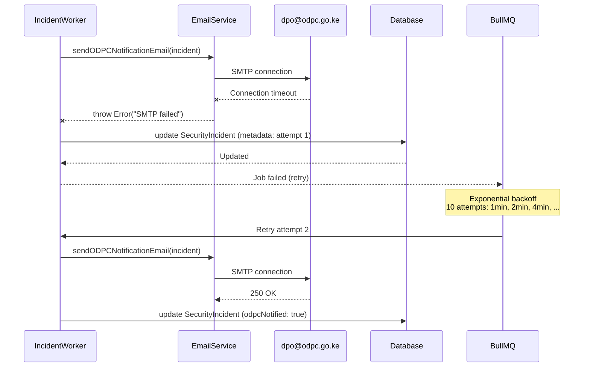

**Implementation**: [workers/compliance/incident.worker.ts](../../workers/compliance/incident.worker.ts) + [workers/compliance/notification.worker.ts](../../workers/compliance/notification.worker.ts) + [lib/notifications/](../notifications/)

---

## 5. Field-Level Encryption

**Goal**: Transparent encryption of sensitive PII (GDPR Art. 32 - Security of Processing).

### Encryption Architecture

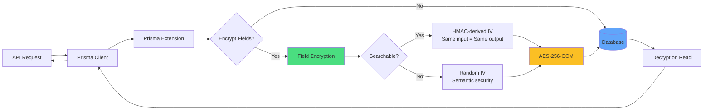

### Configuration

```typescript
// apps/client/app/lib/gdpr/encryption/prisma-extension.ts
const encryptionConfig = {
  User: {
    kraPIN: "deterministic", // Searchable (HMAC IV)
    phoneNumber: "randomized", // Non-searchable (random IV)
    nationalId: "deterministic",
  },
  Professional: {
    taxIdentificationNumber: "deterministic",
  },
};
```

### Encrypted Field Format

```text
enc:v1:<base64-encrypted-data>:<base64-iv>:<base64-auth-tag>
```

**Example**:

```text
enc:v1:a2V5...==:b2l2...==:c3RhZw==
```

**Implementation**: [lib/gdpr/encryption/field-encryption.ts](encryption/field-encryption.ts) + [lib/gdpr/encryption/prisma-extension.ts](encryption/prisma-extension.ts)

---

## 6. Audit Logging

**Goal**: Comprehensive audit trail for all GDPR operations (GDPR Art. 30 - Records of Processing).

### Logged Actions

```typescript
enum AuditAction {
  // Data Access
  DATA_EXPORT_REQUESTED
  DATA_EXPORT_COMPLETED
  DATA_EXPORT_DOWNLOADED

  // Consent
  CONSENT_GRANTED
  CONSENT_REVOKED

  // Deletion
  ACCOUNT_DEACTIVATED
  ACCOUNT_REACTIVATED
  ACCOUNT_ANONYMIZED

  // Breaches
  BREACH_DETECTED
  BREACH_REPORTED_ODPC
  BREACH_USERS_NOTIFIED

  // Admin Actions
  ADMIN_DATA_ACCESS
  ADMIN_LEGAL_HOLD_APPLIED
  ADMIN_LEGAL_HOLD_RELEASED
}
```

### API Reference: Audit Logs

#### `GET /api/admin/audit-logs`

Query audit logs with filters.

**Query Parameters**:

- `userId` (optional): Filter by user ID
- `action` (optional): Filter by action type
- `startDate` (optional): Filter by date range
- `endDate` (optional): Filter by date range
- `page` (default: 1)
- `limit` (default: 50)

**Response**:

```json
{
  "logs": [
    {
      "id": "log_123",
      "userId": "user_456",
      "action": "DATA_EXPORT_REQUESTED",
      "timestamp": "2024-01-29T10:00:00Z",
      "ipAddress": "192.168.1.1",
      "userAgent": "Mozilla/5.0...",
      "metadata": {
        "exportId": "export_789"
      }
    }
  ],
  "pagination": {
    "total": 1000,
    "page": 1,
    "limit": 50,
    "pages": 20
  }
}
```

**Implementation**: [lib/gdpr/services/compliance.service.ts](services/compliance.service.ts)

---

## Testing

### Unit Tests

Comprehensive test coverage (80%+ target) using Vitest with deterministic mocks.

```bash
# Run all tests
pnpm test

# Run with coverage
pnpm test:coverage

# Run specific module tests
pnpm test __tests__/lib/gdpr
pnpm test __tests__/workers
```

**Test Files**:

- [**tests**/lib/gdpr/services/export.test.ts](../../../__tests__/lib/gdpr/services/export.test.ts)
- [**tests**/lib/gdpr/services/compliance.test.ts](../../../__tests__/lib/gdpr/services/compliance.test.ts)
- [**tests**/lib/gdpr/services/consent.test.ts](../../../__tests__/lib/gdpr/services/consent.test.ts)
- [**tests**/lib/gdpr/services/anonymization.test.ts](../../../__tests__/lib/gdpr/services/anonymization.test.ts)
- [**tests**/workers/export/processor.test.ts](../../../__tests__/workers/export/processor.test.ts)
- [**tests**/workers/compliance/incident.test.ts](../../../__tests__/workers/compliance/incident.test.ts)

**Mock Factories**: [**tests**/mocks/index.ts](../../../__tests__/mocks/index.ts)

### Integration Tests

Full workflow testing against real Redis and PostgreSQL instances.

See [**tests**/setup-integration.md](../../../__tests__/setup-integration.md) for Docker Compose setup and instructions.

---

## Key Design Principles

1. **Privacy by Design**: Encryption and anonymization built into core architecture
2. **Data Minimization**: Collect only necessary data, delete after retention period
3. **Transparency**: Clear audit trails for all data operations
4. **Security**: AES-256-GCM encryption, signed S3 URLs, secure session handling
5. **Compliance**: GDPR Articles 7, 17, 20, 30-34 + Kenya DPA Sections 30, 38-39, 43
6. **Resilience**: Exponential backoff retries, job queues, graceful error handling
7. **Testability**: 80%+ coverage with isolated mocks and deterministic test data

---

## Compliance Checklist

- ✅ **Lawful Basis** (Art. 6): Explicit consent tracking with versioning
- ✅ **Consent** (Art. 7): Granular consent management with audit logs
- ✅ **Right of Access** (Art. 15): Audit log queries for user data access
- ✅ **Right to Rectification** (Art. 16): User profile update APIs
- ✅ **Right to Erasure** (Art. 17): 3-phase anonymization with legal holds
- ✅ **Right to Data Portability** (Art. 20): ZIP export with JSON/CSV formats
- ✅ **Records of Processing** (Art. 30): Comprehensive audit logging
- ✅ **Security of Processing** (Art. 32): AES-256-GCM encryption, access controls
- ✅ **Breach Notification to Authority** (Art. 33): 72-hour ODPC notification
- ✅ **Breach Notification to Users** (Art. 34): Batched email/SMS with retries
- ✅ **Kenya DPA Section 30**: Consent documentation and management
- ✅ **Kenya DPA Section 38-39**: Right to erasure and objection
- ✅ **Kenya DPA Section 43**: Breach notification to ODPC

---

## Support

For questions or issues:

- **Data Protection Officer**: <dpo@buildmarket.co.ke>
- **Security Team**: <security@buildmarket.co.ke>
- **Developer Documentation**: This README + inline code comments
- **Test Plan**: [**tests**/TEST_PLAN.md](../../../__tests__/TEST_PLAN.md)

Last Updated: February 2, 2026
