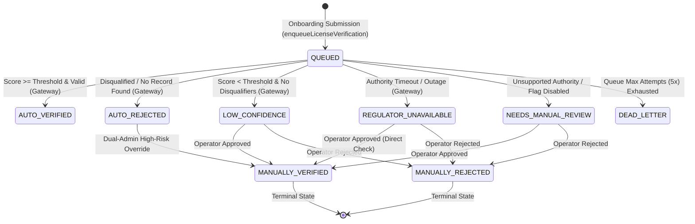
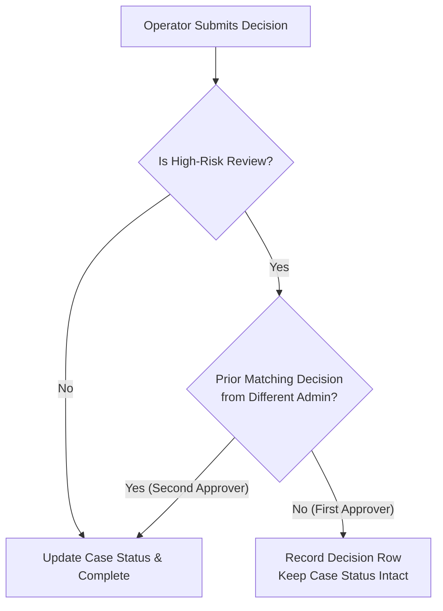

# Regulator Verification Domain Slice (`app/lib/domains/regulator-verification`)

## Overview & System Role

The **Regulator Verification Domain Slice** is the authoritative domain layer in `apps/client` for professional license verification, automated confidence scoring, worker queue orchestration, operator triage workflows, and regulatory compliance evidence retention.

It manages statutory license verification across Kenya's professional licensing authorities:

- **EBK** (Engineers Board of Kenya)
- **BORAQS** (Board of Registration of Architects and Quantity Surveyors)
- **NCA** (National Construction Authority)
- **EARB** (Estate Agents Registration Board)
- **VRB** (Valuers Registration Board)
- **ISK** (Institution of Surveyors of Kenya)
- **EPRA** (Energy and Petroleum Regulatory Authority)

The slice acts as a secure firewall protecting platform integrity. It prevents fraudulent, revoked, or expired professional credentials from gaining verified platform status by combining automated HTTP adapters, deterministic confidence scoring, dual-admin approval controls for high-risk manual decisions, and strict privacy/retention policies for regulatory evidence.

---

## Component Architecture & Module Structure

```text
app/lib/domains/regulator-verification/
├── README.md                    # Staff-level architecture and domain specification
├── index.ts                     # Public API barrel file (gateway, scoring, evidence, operator, queue, outcomes)
├── gateway.ts                   # Gateway engine (RegulatorVerificationGateway, threshold routing, dedupe key generator)
├── confidence-scoring.ts        # Versioned multi-rule scoring engine (CONFIDENCE_ALGORITHM_VERSION, fuzzy matching, disqualifiers)
├── evidence-store.ts            # Persistent case store, RBAC evidence redaction, audit logging, and retention cleanup
├── operator-service.ts          # Manual verification triage services (list cases, detail with duplicate check, dual-admin decision)
├── outcomes.ts                  # Transactional outcome handlers (handleVerificationSuccess, handleVerificationFailure, JetStream events)
├── queue.ts                     # BullMQ queue orchestration (enqueueLicenseVerification, 5x exponential retries)
├── regulator-lookup-links.ts    # Human operator reference links for statutory authority registers
└── adapters/                    # Authority-specific integration adapters
    ├── index.ts                 # Adapter registry & SystemSettings auto-verify flag mapper (buildProductionAdapterMap)
    ├── http-regulator-adapter.ts# Base HTTP adapter (fetch wrapper, HMAC signing, timeout budget, error taxonomy)
    ├── credentials.ts           # Lazy envConfig credential loader (loadRegulatorCredentials)
    ├── default-response-mapper.ts# Fallback snake_case JSON response mapper
    ├── boraqs/                  # BORAQS adapter definition & path builder
    ├── earb/                    # EARB adapter definition & path builder
    ├── ebk/                     # EBK adapter definition & path builder
    ├── epra/                    # EPRA adapter definition & path builder
    ├── isk/                     # ISK adapter definition & path builder
    ├── nca/                     # NCA adapter definition & path builder
    └── vrb/                     # VRB adapter definition & path builder
```

### Import Direction & Architectural Boundaries (ADR-002 & ADR-003)

- **External Callers** (`app/workers/*`, `app/api/*`, `actions/*`, `components/*`) MUST import strictly from the top-level domain barrel:

  ```ts
  import {
    RegulatorVerificationGateway,
    enqueueLicenseVerification,
    listVerificationCases,
    recordManualDecision,
  } from "@/app/lib/domains/regulator-verification";
  ```

- **Domain Service Layer** (`gateway.ts`, `operator-service.ts`, `outcomes.ts`, `evidence-store.ts`) owns business rules, actor verification, confidence evaluation, and side-effect coordination.
- **Persistence Layer** (`evidence-store.ts`, Prisma models) handles database CRUD operations for `RegulatorVerificationCase` and `RegulatorVerificationDecision` tables without leaking transport or UI state.

---

## Verification Lifecycle State Machine

Verification requests progress through a strictly tracked lifecycle state machine backed by `RegulatorVerificationCaseStatus` in Prisma:



### Canonical Lifecycle States

| State                   | Category     | Description                                                                                      |            Terminal?             |
| :---------------------- | :----------- | :----------------------------------------------------------------------------------------------- | :------------------------------: |
| `QUEUED`                | Pending      | Enqueued in BullMQ; awaiting worker processing                                                   |                No                |
| `AUTO_VERIFIED`         | Verified     | Automated adapter matched record; confidence score crossed authority threshold                   |       No (Can be reviewed)       |
| `AUTO_REJECTED`         | Rejected     | Disqualified due to explicit invalid status (revoked/suspended), expired date, or 404 no record  | No (High-risk override possible) |
| `LOW_CONFIDENCE`        | Manual Queue | Adapter returned a record, but confidence score fell below the threshold (e.g. name fuzzy match) |                No                |
| `REGULATOR_UNAVAILABLE` | Manual Queue | Authority API timed out (8s), hit 5xx errors, or rate limits exhausted                           |                No                |
| `NEEDS_MANUAL_REVIEW`   | Manual Queue | Authority unsupported or disabled via `SystemSettings` auto-verify flag                          |                No                |
| `DEAD_LETTER`           | Failed       | BullMQ retry budget (5 attempts) exhausted due to persistent error                               |                No                |
| `MANUALLY_VERIFIED`     | Terminal     | Approved by human operator (or dual-admin override for high-risk cases)                          |               Yes                |
| `MANUALLY_REJECTED`     | Terminal     | Rejected by human operator                                                                       |               Yes                |

---

## Automated Confidence Scoring Subsystem (`confidence-scoring.ts`)

Confidence scoring is performed deterministically by `scoreVerification()`. The algorithm is explicitly versioned (`CONFIDENCE_ALGORITHM_VERSION = "v2-2026-08-01"`) and recorded on every `RegulatorVerificationResult` to maintain historical audit interpretability across algorithm updates.

### Weighted Rule Breakdown

Enabled confidence rules are strictly required to sum to **1.0** (validated at module load via `assertWeightsSumToOne`):

| Rule ID                |  Weight  | Evaluation Criteria & Scoring Logic                                                                                                                                           |
| :--------------------- | :------: | :---------------------------------------------------------------------------------------------------------------------------------------------------------------------------- |
| `license_number_match` | **0.45** | Exact case-insensitive match of normalized license number (`1.0` for match, `0.0` for mismatch).                                                                              |
| `identity_match`       | **0.30** | Credit awarded for exact holder match (`1.0`), tokenized Levenshtein similarity $\ge 0.85$ (`0.50`), or exact company match (`0.75`); `0.0` for mismatch or unsubmitted data. |
| `status_active`        | **0.20** | `1.0` if status is active (`ACTIVE`, `VALID`, `CURRENT`, `REGISTERED`, `LICENSED`); `0.0` if invalid (`SUSPENDED`, `REVOKED`, `EXPIRED`, `INVALID`).                          |
| `not_expired`          | **0.05** | `1.0` if `expiresAt` is null, unparseable, or $\ge$ current date; `0.0` if expired.                                                                                           |

### Mathematical Invariants & Disqualification Rules

1. **Hard License Number Gate:**
   $$\text{Max Non-License Score} = 0.30 (\text{identity}) + 0.20 (\text{status}) + 0.05 (\text{expiry}) = 0.55$$
   Because the maximum non-license score is $0.55$, no combination of matching name, active status, and non-expired date can ever reach the default auto-verify threshold ($0.82$) without an exact license number match.

2. **Authoritative Disqualification:**
   If a regulator record explicitly reports an invalid status (`SUSPENDED`, `REVOKED`, `EXPIRED`, `INVALID`) or an expired date (`expiresAt < now`), the engine sets `disqualified: true`. Callers immediately route the case to `AUTO_REJECTED` regardless of the numeric score—preventing high identity scores from ever overriding an expired or revoked license.

---

## Per-Authority HTTP Adapters & Feature Flags (`adapters/`)

### 1. Unified HTTP Adapter (`HttpRegulatorAdapter`)

All statutory authority adapters derive from `HttpRegulatorAdapter`, which standardizes:

- **Timeout Budget:** 8-second default timeout via `AbortController`.
- **HMAC Request Signing:** Standard `Authorization: Bearer <apiKey>` and optional HMAC SHA-256 request signature (`X-Signature`) computed over `METHOD\nPATH\nTIMESTAMP`.
- **Structured Error Taxonomy (`RegulatorAdapterError`):**
  - `TIMEOUT` / `NETWORK` / `SERVER_ERROR` / `RATE_LIMITED`: Transient failures mapped to `retryable: true` with backoff seconds.
  - `AUTH` / `MALFORMED_RESPONSE`: Non-retryable configuration or contract errors mapped to `retryable: false` to avoid wasting retry budgets.

### 2. Feature-Flagged Production Routing (`buildProductionAdapterMap`)

Authority adapters are wired via `buildProductionAdapterMap()`, which checks real-time `SystemSettings` kill switches:

- `enableAutoVerifyNCA`
- `enableAutoVerifyEPRA`
- `enableAutoVerifyBORAQS`
- `enableAutoVerifyEBK`
- `enableAutoVerifyEARB`
- `enableAutoVerifyVRB`
- `enableAutoVerifyISK`

When an authority's flag is `false` or unconfigured, `buildProductionAdapterMap()` excludes the adapter, causing `RegulatorVerificationGateway` to gracefully fall back to `NEEDS_MANUAL_REVIEW`. This allows new authority mappers to run in shadow-mode validation before enabling automated verification.

---

## Operator Triage & Manual Review Workflow (`operator-service.ts`)

The operator service powers the verification operations administrative interface.

### 1. Paginated Queue Triage (`listVerificationCases`)

Optimized query returning lightweight case summaries (`id`, `professionalId`, `authority`, `licenseNumber`, `status`, `confidence`, `attempts`) without loading heavy JSON evidence payloads.

### 2. Deep Case Inspection & Stolen License Detection (`getVerificationCaseDetail`)

Retrieves complete case detail, redacted evidence payload, audit history, and cross-checks **duplicate cases** across all professionals sharing the same authority and license number. This enables operators to catch reused or stolen license numbers across different accounts.

### 3. Dual-Admin High-Risk Review Control (`recordManualDecision`)

Manual decisions require an explicit `reasonCode` and `outcome` (`APPROVE`, `REJECT`, `REQUEST_MORE_INFO`).



- **High-Risk Threshold:** Overriding an auto-rejection or approving a low-confidence/expired record is flagged as `highRiskReview: true`.
- **Dual-Admin Enforcement:** High-risk approvals require endorsement from two distinct `adminId`s. The first approval records the recommendation (`isSecondApprover: false`) but leaves the case in its review status. The second approval from a different admin (`isSecondApprover: true`) flips the case status to `MANUALLY_VERIFIED`.

---

## Security, Privacy & Compliance Policies (`evidence-store.ts`)

### 1. Role-Gated Evidence Redaction (`redactEvidenceForOperator`)

Raw regulator payloads (`rawRecord`) may contain sensitive PII (national identity numbers, personal addresses). Access to `rawRecord` is restricted to authorized roles:

- `SUPER_ADMIN`
- `VERIFICATION_COMPLIANCE_OFFICER`

All other administrative roles receive a redacted evidence view containing only normalized comparison fields (`holderName`, `licenseNumber`, `companyName`, `status`, `expiresAt`).

### 2. Audit Trail Logging (`logEvidenceViewedAuditEvent`)

Viewing unredacted raw evidence triggers an immutable `EVIDENCE_VIEWED` audit entry in `AuditLog` and a dedicated `RegulatorVerificationEvidenceView` table row, recording `viewerId`, `viewerRole`, `caseId`, `unredacted` flag, and timestamp.

### 3. Data Retention Enforcement (`enforceEvidenceRetention`)

To comply with regulatory privacy requirements, `enforceEvidenceRetention()` strips unredacted `rawRecord` fields from cases older than the specified retention period (`retentionDays`), while preserving normalized audit metadata and decision histories intact.

### 4. Audit & Decision Retention Invariants (`migration 20260803000000`)

To satisfy statutory compliance and prevent audit log destruction:

- `RegulatorVerificationCase.licenseId` is optional (`String?`) with `onDelete: SetNull`. Deleting or archiving a `ProfessionalLicense` unlinks the license but leaves the `RegulatorVerificationCase`, `professionalId`, `authority`, `licenseNumber`, confidence history, and evidence snapshots 100% intact.
- `RegulatorVerificationDecision` and `RegulatorVerificationEvidenceView` enforce `onDelete: Restrict`. Operator decision histories and evidence access audit logs can **never** be deleted out from under statutory compliance audits.

---

## Queue & Event Orchestration (`queue.ts` & `outcomes.ts`)

### 1. Idempotent BullMQ Enqueuing (`queue.ts`)

- Queue Name: `license-verification`
- Max Retries: 5 attempts with exponential backoff (5s base delay).
- Deduplication: Job IDs are generated using `buildRegulatorVerificationJobId(request)` (`authority:licenseNumber:professionalId`). Duplicate enqueues for an in-flight job are safely ignored.

### 2. Transactional Outcome Handlers (`outcomes.ts`)

Upon verification completion, `handleVerificationSuccess` or `handleVerificationFailure` executes:

1. **Prisma Transaction:** Updates `ProfessionalLicense.status` (`VERIFIED` or `NEEDS_CORRECTION`), writes an `AdminAuditLog` record (`AUTO_VERIFY_LICENSE` or `AUTO_VERIFY_LICENSE_FAILED`), and upserts the `RegulatorVerificationCase` attempt record.
2. **NATS JetStream Publishing:** Emits `license.auto_verified` or `license.auto_verify_failed` with a deterministic message ID (`msgId: license-verify-[success|failure]-<licenseId>-<correlationId>`) to ensure downstream event idempotency.

---

## Manual Lookup Links (`regulator-lookup-links.ts`)

Because statutory authorities in Kenya do not currently offer public API search endpoints, `regulator-lookup-links.ts` maintains operator reference links to official registers (e.g. NCA, VRB).

> [!IMPORTANT]
> Lookup links are strictly administrative helpers for human reviewers. They are explicitly isolated from automated decision pipelines in `gateway.ts` and `adapters/` to prevent link rot from affecting verification logic.

---

## Automated Verification & Test Coverage

The domain slice is comprehensively verified by unit and integration test suites:

```bash
# Run all regulator-verification domain unit tests
pnpm --filter client test run __tests__/lib/domains/regulator-verification/

# Run adapter-specific test suites
pnpm --filter client test run __tests__/lib/domains/regulator-verification/adapters/
```

### Key Test Suites

- **`gateway.test.ts`:** Tests gateway routing, fallback handling for unsupported authorities, unavailable regulators, and threshold application.
- **`confidence-scoring.test.ts`:** Validates rule weight calculations, Levenshtein fuzzy matching, disqualifier triggers, and weight sum invariants.
- **`evidence-store.test.ts`:** Tests case upserts, dead-letter marking, role-gated evidence redaction, and retention cleanup.
- **`operator-service.test.ts`:** Validates list filtering, duplicate license detection, reason code enforcement, and dual-admin high-risk review logic.
- **`adapters/http-regulator-adapter.test.ts`:** Tests fetch handling, timeout aborts, HMAC signature generation, and error taxonomy mapping.
