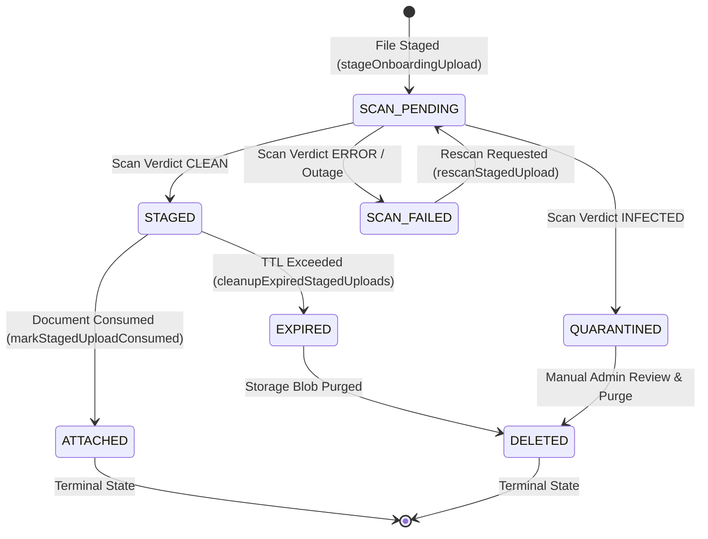

# Uploads Domain Slice (`app/lib/domains/uploads`)

## Overview & System Role

The **Uploads Domain Slice** is the authoritative domain layer for file ingestion, virus/malware threat scanning, document staging lifecycle state management, storage provider abstraction, and TTL-based background cleanup within `apps/client`.

It protects the platform against malicious document uploads (PDFs, images, licenses, contracts) by enforcing strict fail-closed malware scanning, private storage visibility, state-transition-guarded database records, short-lived preview URLs, and authenticated download allow-lists.

---

## Component Boundaries & File Structure

```text
app/lib/domains/uploads/
├── README.md                    # This architecture and domain specification document
├── index.ts                     # Public API barrel file (exports services, repositories, types, state machine helpers)
├── upload-lifecycle.ts          # State machine definitions, transition guards, and Prisma enum parity helpers
├── virus-scanner.ts             # VirusScanner domain interface, scanner registry, bootstrap initializer, and MockVirusScanner
├── cloudmersive-scanner.ts      # Cloudmersive Advanced Virus Scan API adapter (structural & signature threat detection)
├── service.ts                   # Core uploadService business logic, scanning orchestrations, and preview/download presigning
├── repository.ts                # Persistence layer (uploadRepository) wrapping Prisma OnboardingUpload, Asset, and DirectUpload tables
└── mappers.ts                   # DTO serialization and ISO date mapping utilities
```

### Import Direction & Public API Boundary

- **Presentation & Adapters** (`app/api/uploads/*`, `components/*`, `hooks/*`) MUST import strictly from `index.ts` via `@/app/lib/domains/uploads`.
- **Domain Internal** (`service.ts`, `repository.ts`) must not import presentation components or route adapters.
- **Third-Party Infrastructure** (`getStorageProvider()`, `@/app/lib/infrastructure/env`) is accessed behind repository and service abstractions.

---

## Upload Lifecycle State Machine (`upload-lifecycle.ts`)

The onboarding document staging lifecycle is backed by a guarded state machine. Every state in `UploadLifecycleState` maps 1-to-1 with a value in the Prisma `OnboardingUploadStatus` enum.



### Canonical Lifecycle States

| State          | Description                                                                               | Category           | Reachable Transitions                                |
| -------------- | ----------------------------------------------------------------------------------------- | ------------------ | ---------------------------------------------------- |
| `SCAN_PENDING` | Upload stored temporarily in `buildmarket-staged` bucket, awaiting scan verdict           | Active             | `STAGED`, `SCAN_FAILED`, `QUARANTINED`               |
| `STAGED`       | Scan completed clean. Ready to be linked to a domain entity (e.g. `ProfessionalDocument`) | Active             | `ATTACHED`, `EXPIRED`, `QUARANTINED`, `SCAN_PENDING` |
| `SCAN_FAILED`  | Scanner outage or network error during scan. Eligible for retry via `rescanStagedUpload`  | Active / Retryable | `SCAN_PENDING`, `QUARANTINED`, `EXPIRED`             |
| `QUARANTINED`  | Malware or structural threat detected. Isolated from public/private read routes           | Isolated           | `DELETED` (after manual review)                      |
| `ATTACHED`     | Upload materialized and attached to a domain asset/document                               | Terminal           | None                                                 |
| `EXPIRED`      | Staged upload exceeded TTL (default 24h) without being attached                           | Cleanup Eligible   | `DELETED`                                            |
| `DELETED`      | Storage blob purged from R2/S3; row retained for audit history                            | Terminal           | None                                                 |

### State Machine Transition Rules

State transitions are strictly validated at runtime by `isValidTransition(from, to)` in `upload-lifecycle.ts` and transactionally enforced in `uploadRepository.transitionStagedUploadStatus()`. Attempting an illegal transition (e.g. `ATTACHED` -> `STAGED` or `SCAN_FAILED` -> `ATTACHED`) throws an `InvalidStatusTransitionError`.

---

## Virus & Malware Scanning Subsystem (`virus-scanner.ts` & `cloudmersive-scanner.ts`)

Scanning is performed using a domain-agnostic `VirusScanner` interface.

```ts
export interface VirusScanner {
  scanUpload(input: ScanInput): Promise<ScanResult>;
}
```

### 1. Vendor Adapter (`CloudmersiveVirusScanner`)

Concrete production adapter using Cloudmersive's `/virus/scan/file/advanced` API endpoint. Evaluates both signature-based malware and structural document threats:

- Executive macros (`ContainsMacros`)
- OLE embedded objects (`ContainsOleEmbeddedObject`)
- XML External Entities (`ContainsXmlExternalEntities` / XXE)
- Insecure deserialization payloads
- HTML / script injection in non-HTML documents (`ContainsHtml`, `ContainsScript`)
- Unsafe zip-bomb archives (`ContainsUnsafeArchive`)
- Restricted or mismatched file formats (`ContainsRestrictedFileFormat`, `ContainsInvalidFile`)

### 2. Startup Eager Registration (`initializeProductionVirusScanner`)

Lazy auto-wiring is strictly prohibited to prevent startup assertion failures. Production wiring occurs eagerly during Next.js Node.js runtime initialization in `instrumentation.ts`:

```ts
// instrumentation.ts
export async function register() {
  if (process.env.NEXT_RUNTIME === "nodejs") {
    const { initializeProductionVirusScanner } =
      await import("./app/lib/domains/uploads/virus-scanner");
    const { envConfig } = await import("./app/lib/infrastructure/env");

    initializeProductionVirusScanner({
      storage: {
        cloudmersiveApiKey: envConfig.storage.cloudmersiveApiKey,
        cloudmersiveBaseUrl: envConfig.storage.cloudmersiveBaseUrl,
      },
      isProd: envConfig.isProd,
      features: { allowMockScanner: envConfig.features.allowMockScanner },
    });
  }
}
```

If `env.isProd` is `true` and no real scanner is registered (and `allowMockScanner` is `false`), `initializeProductionVirusScanner()` throws a fatal startup error before the application can accept HTTP traffic.

---

## Security & Defense-in-Depth Policies

### 1. Private Storage Visibility & Presigned Previews

- Objects staged via `stageOnboardingUpload` are written to storage with `visibility: "private"`.
- Raw storage URLs are never returned directly to client browsers or persisted long-term in draft states.
- `generateShortLivedPreviewUrl()` generates signed preview URLs capped at a hard maximum TTL of 15 minutes (900s).

### 2. Fail-Closed Download Route Allow-List (`download/route.ts`)

The document download route enforces strict allow-list verification:

```ts
const DOWNLOADABLE_STATUSES = new Set(["STAGED", "ATTACHED", "CONSUMED"]);
```

Any download attempt for a staged upload in `SCAN_PENDING`, `SCAN_FAILED`, or `QUARANTINED` status is blocked immediately with HTTP 403 Forbidden.

### 3. Vendor Rescan Cost-Abuse Defense (`rescanStagedUpload`)

To prevent malicious or buggy callers from flooding live vendor scan endpoints:

```ts
if (
  staged.status === "ATTACHED" ||
  staged.status === "CONSUMED" ||
  staged.status === "EXPIRED" ||
  staged.status === "DELETED" ||
  staged.status === "STAGED"
) {
  return fail("conflict", `Cannot rescan an upload in ${staged.status} state`);
}
```

Calling `/api/uploads/staged/[id]/scan` for an upload that is already clean (`STAGED`) returns a `409 Conflict` domain error without issuing a paid vendor scan request.

---

## Architecture Decision: Scan Pipeline Topology

As documented in [`ARCHITECTURE_DECISION_scan_pipeline.md`](file:///c:/Users/User/build-market/apps/client/docs/progress/ARCHITECTURE_DECISION_scan_pipeline.md):

1. **Primary In-App Synchronous Scanning:** `stageOnboardingUpload` scans files inline (<25MB) during the staging request. The client receives the final verdict in the initial round trip.
2. **Idle R2 Event-Driven Worker:** The Cloudflare Worker (`workers/r2-scan-worker.ts`) and Queue infrastructure remain deployed and hardened (HMAC signature verification, DLQ, exponential backoff retries), but R2 bucket creation event notifications are intentionally paused to eliminate duplicate scanning overhead and log noise.

---

## Automated Verification & Test Coverage

The uploads domain slice is backed by 9 unit and integration test suites:

```bash
# Run all upload domain unit tests
pnpm --filter client test run __tests__/lib/uploads/

# Run upload API route integration tests
pnpm --filter client test run __tests__/api/uploads/
```

### Key Test Suites

- **`upload-lifecycle.test.ts`:** Validates state machine transitions, invalid transition rejections, and derived `ALL_STATES` parity against Prisma `OnboardingUploadStatus`.
- **`virus-scanner.test.ts`:** Validates `MockVirusScanner` signature/EICAR detection, `initializeProductionVirusScanner()` eager registration, and production startup assertion errors.
- **`service.test.ts` & `service-phase4.test.ts`:** Validates `stageOnboardingUpload`, `rescanStagedUpload`, preview URL generation, and storage cleanup.
- **`staged-download.test.ts`:** Validates download route owner/admin authorization, HTTP `no-store` headers, audit logging, and 403 Forbidden enforcement on non-downloadable states.
- **`upload-queue.test.ts`:** Validates client-side bounded concurrency (2), exponential backoff retries, and non-retryable `quarantined` state handling.
