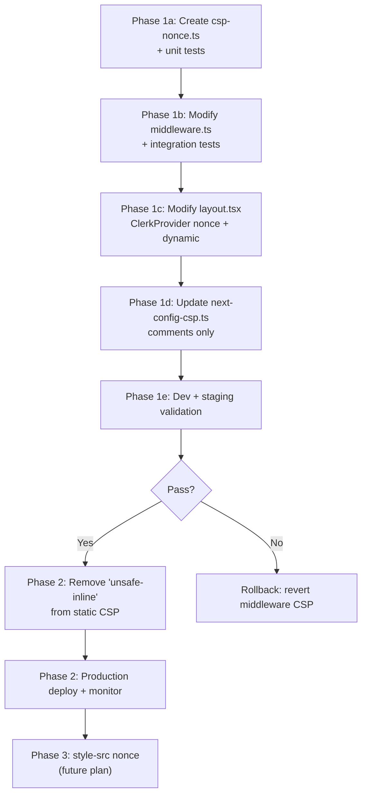

# CSP Nonce Strategy: Eliminating `'unsafe-inline'` from `script-src-elem`

## Background

ADR-008 §4 ("Future Work") tracks the long-term goal of removing `'unsafe-inline'` from the `script-src-elem` CSP directive. Today, this exception exists solely to support Clerk's authentication bootstrap scripts that inject inline `<script>` tags into the document. Eliminating it requires generating a per-request cryptographic nonce in middleware, threading it through the CSP header, and propagating it to every surface that produces inline scripts.

### Current State

| Surface                                                                                 | Current CSP Posture                                 | Nonce Impact                                                        |
| --------------------------------------------------------------------------------------- | --------------------------------------------------- | ------------------------------------------------------------------- |
| [next-config-csp.ts](file:///c:/Users/User/build-market/apps/client/next-config-csp.ts) | `script-src-elem 'unsafe-inline' ...` (L105)        | Must accept `'nonce-<value>'` instead                               |
| [middleware.ts](file:///c:/Users/User/build-market/apps/client/middleware.ts)           | No CSP involvement; delegates to `clerkMiddleware`  | Becomes the nonce generation + CSP injection point                  |
| [layout.tsx](file:///c:/Users/User/build-market/apps/client/app/layout.tsx)             | `<ClerkProvider>` with no `nonce` or `dynamic` prop | Must read `x-nonce` header and pass `nonce` + `dynamic`             |
| [chart.tsx](file:///c:/Users/User/build-market/apps/client/components/ui/chart.tsx)     | `dangerouslySetInnerHTML` on `<style>` (L84)        | **style-src concern only** — out of scope for Phase 1               |
| [next.config.ts](file:///c:/Users/User/build-market/apps/client/next.config.ts)         | Assembles CSP via `buildCspValue()` in `headers()`  | Static header becomes the **fallback**; middleware takes precedence |

### Key Constraints

- **`@clerk/nextjs` is `^7.2.1`** — supports `nonce` and `dynamic` props on `<ClerkProvider>`.
- **`next` is `15.5.15`** — Next.js automatically detects a CSP header with a nonce and applies it to framework-injected inline scripts.
- **Dynamic rendering is mandatory.** A per-request nonce is incompatible with static generation. The root layout already calls `await auth()`, so it is already dynamically rendered.
- **`style-src 'unsafe-inline'`** is a separate concern (required by Next.js runtime style injection and Recharts). Not addressed in this plan.

---

## User Review Required

> [!IMPORTANT]
> **Performance implication:** Moving CSP header assembly from `next.config.ts headers()` (evaluated once per config load) to middleware (evaluated per request) adds per-request computation. The cost is one `crypto.randomUUID()` + one string concatenation — microseconds on V8 — but this is a change in execution model. Middleware already runs per request for auth, so the marginal cost is negligible.
> [!WARNING]
> **Dual-header conflict risk:** During migration, `next.config.ts` will still emit a static CSP header via `headers()`. Middleware will emit a per-request CSP header. When both are present, **the middleware header must replace, not append to, the static one.** Next.js merges custom headers, so we need the middleware to explicitly overwrite the `Content-Security-Policy` response header. The plan addresses this by keeping the static header as a safety net for routes not matched by middleware, and having middleware always set its own CSP.
> [!CAUTION]
> **Rollback safety:** If the nonce strategy causes a production CSP violation that blocks Clerk, the rollback is to revert middleware to not set CSP and restore `'unsafe-inline'` in the static header. This is a **Two-Way Door** — fully reversible with a single deploy.

---

## Open Questions

> [!NOTE]
> **Q1 — RESOLVED:** Nonce will be added to **both** `script-src` and `script-src-elem` for defense in depth.
> [!NOTE]
> **Q2 — RESOLVED:** `'strict-dynamic'` will be added **now** alongside the nonce. Origin allowlists are retained as fallbacks for browsers that don't support `strict-dynamic`.
> [!NOTE]
> **Q3 — RESOLVED:** Both **Cloudflare Workers** and **Vercel** are live deployment targets. `crypto.randomUUID()` is available in both runtimes. `Buffer.from()` is available in CF Workers via the Node.js compat layer (`nodejs_compat` flag).

---

## Proposed Changes

### Phase 1: Nonce Generation + CSP in Middleware (Core)

This phase is the minimum viable change to eliminate `'unsafe-inline'` from `script-src-elem`.

---

#### [NEW] [csp-nonce.ts](file:///c:/Users/User/build-market/apps/client/app/lib/security/middleware/csp-nonce.ts)

**Purpose:** Isolated module responsible for generating the nonce and assembling the CSP header string for middleware injection. This keeps the middleware handler thin (ADR-002: adapter-only) and makes the CSP assembly independently testable.

**Design:**

```typescript
// app/lib/security/middleware/csp-nonce.ts

/**
 * Generates a cryptographic nonce for CSP injection.
 * Uses crypto.randomUUID() → base64 for a compact, high-entropy value.
 */
export function generateCspNonce(): string {
  return Buffer.from(crypto.randomUUID()).toString("base64");
}

export type CspNonceOptions = {
  nonce: string;
  appOrigin: string;
  apiOrigin: string;
  clerkFrontendApiOrigin: string | null;
  analyticsOrigin: string | null;
  isDev: boolean;
};

/**
 * Assembles the CSP header value with a per-request nonce.
 * Mirrors the directive structure in next-config-csp.ts but replaces
 * 'unsafe-inline' in script-src-elem with 'nonce-<value>'.
 */
export function buildCspWithNonce(opts: CspNonceOptions): string {
  // ... directive assembly, structurally identical to buildCspValue()
  // but with `'nonce-${opts.nonce}'` replacing `'unsafe-inline'` in script-src-elem
}
```

**Architectural rationale:**

- Lives under `app/lib/security/middleware/` — same home as route matchers, redirect policy, and decision logging.
- Does not import from presentation or domain layers (leaf module).
- `buildCspValue()` in `next-config-csp.ts` remains as the static fallback for routes not matched by middleware.

---

#### [MODIFY] [middleware.ts](file:///c:/Users/User/build-market/apps/client/middleware.ts)

**Changes:**

1. Import `generateCspNonce` and `buildCspWithNonce` from the new module.
2. At the **top** of the `clerkMiddleware` handler (before any auth checks), generate a nonce.
3. Read env-derived origins (from `env` import, already present at L25).
4. Build the CSP header string with the nonce.
5. For every `NextResponse.next()` and redirect response, set the `x-nonce` request header (for downstream Server Components) and the `Content-Security-Policy` response header.
6. Wrap the response mutation in a helper to avoid duplicating header-setting logic across all return paths.

**Key design detail — response wrapping:**

```typescript
function withCspHeaders(
  response: NextResponse,
  nonce: string,
  cspValue: string,
): NextResponse {
  // Pass nonce to Server Components via request header
  response.headers.set("x-nonce", nonce);
  // Set CSP on the response (overrides the static header from next.config.ts)
  response.headers.set("Content-Security-Policy", cspValue);
  return response;
}
```

Every `return NextResponse.next()` and `return redirectTo*(...)` call in the middleware wraps through this helper. This is a mechanical change — no behavioral modification to auth logic.

> [!NOTE]
> The `clerkMiddleware` wrapper returns the final response. The nonce and CSP are injected on the response object before it leaves the handler. Clerk's own middleware processing happens before our handler runs, so the nonce is not consumed by Clerk middleware itself — it's consumed downstream by `<ClerkProvider nonce={...}>`.

---

#### [MODIFY] [layout.tsx](file:///c:/Users/User/build-market/apps/client/app/layout.tsx)

**Changes:**

1. Import `headers` from `next/headers`.
2. Read `x-nonce` from request headers in the `RootLayout` async function.
3. Pass `nonce` and `dynamic` props to `<ClerkProvider>`.

```diff
+import { headers } from "next/headers";

 export default async function RootLayout({ children }: ...) {
+  const headersList = await headers();
+  const nonce = headersList.get("x-nonce") ?? "";
   const { auth } = await import("@clerk/nextjs/server");
   const { userId } = await auth();
   const isSignedIn = !!userId;

   return (
-    <ClerkProvider>
+    <ClerkProvider nonce={nonce} dynamic>
       <html lang="en" className={dmSans.variable}>
```

**Why `dynamic`?** The `dynamic` prop tells ClerkProvider to render dynamically per request rather than attempting static optimization. Since the root layout already calls `await auth()`, it is already dynamically rendered — this prop makes it explicit and ensures Clerk's script injection respects the nonce.

---

#### [MODIFY] [next-config-csp.ts](file:///c:/Users/User/build-market/apps/client/next-config-csp.ts)

**Changes:**

- Add a comment at L104-105 documenting that the `'unsafe-inline'` in `script-src-elem` is now the **static fallback** for requests not processed by middleware (e.g., if middleware matcher excludes certain paths).
- No functional change in Phase 1 — the static header remains as a safety net.

```diff
-    // Clerk requires 'unsafe-inline' for its inline bootstrap scripts in modern browsers
-    `script-src-elem 'unsafe-inline' ${dedup(scriptOrigins).join(" ")}`,
+    // FALLBACK: Middleware injects a per-request nonce-based CSP for browser routes.
+    // This static 'unsafe-inline' directive covers routes not matched by middleware
+    // (e.g., static assets, non-document requests). See ADR-008 §4 nonce strategy.
+    `script-src-elem 'unsafe-inline' ${dedup(scriptOrigins).join(" ")}`,
```

---

#### [MODIFY] [clerk-nextjs-server.d.ts](file:///c:/Users/User/build-market/apps/client/types/clerk-nextjs-server.d.ts)

**Changes:** The `clerkMiddleware` type declaration currently only accepts a handler function. If Clerk's actual types don't expose the options overload we need, we may need to update this `.d.ts`. However, since we're using the handler-function form (not the options-object form), no type change is needed for Phase 1.

**No change required.**

---

### Phase 2: Harden + Remove Static Fallback

After Phase 1 is validated in production:

#### [MODIFY] [next-config-csp.ts](file:///c:/Users/User/build-market/apps/client/next-config-csp.ts) — Remove Static Fallback

- Remove `'unsafe-inline'` from `script-src-elem` entirely.
- The static CSP becomes nonce-agnostic (no inline scripts permitted without nonce, which is only available via middleware).
- This is the actual security hardening step — Phase 1 ensures the nonce path works before we remove the fallback.

#### [OPTIONAL] Add `'strict-dynamic'` to `script-src-elem`

- Depending on Q2 resolution, add `'strict-dynamic'` so that nonce-authorized scripts can load subsequent scripts without origin allowlisting.
- This would simplify the Clerk origin allowlist (no need for `cdn.jsdelivr.net`, `img.clerk.com`, etc. in `script-src`).

---

### Phase 3: Style-src Nonce (Future — Not This Plan)

Tracked for awareness:

- `style-src 'unsafe-inline'` is required by Next.js runtime style injection and Recharts `dangerouslySetInnerHTML` in [chart.tsx](file:///c:/Users/User/build-market/apps/client/components/ui/chart.tsx#L82-L103).
- Eliminating this requires a CSS-in-JS nonce propagation strategy across the entire component tree, which is a substantially larger surface.
- **Not part of this plan.**

---

## Blast Radius & Reversibility

### Layers Affected

| Layer                  | Impact                                                             | Risk                                            |
| ---------------------- | ------------------------------------------------------------------ | ----------------------------------------------- |
| **Middleware**         | New CSP header injection per request                               | Medium — touches every response                 |
| **Root Layout**        | `<ClerkProvider>` prop addition                                    | Low — additive, no existing behavior removed    |
| **CSP Config**         | Comment-only change (Phase 1)                                      | None                                            |
| **All browser routes** | CSP header now contains `nonce-<value>` instead of `unsafe-inline` | High — any missed inline script will be blocked |

### Door Classification: **Two-Way Door**

- **Rollback:** Revert middleware to not set CSP headers → static fallback with `'unsafe-inline'` takes over → zero user impact.
- **Rollback time:** Single deploy cycle.
- **No data migration, no schema change, no external API contract change.**

### What Breaks If Copy-Pasted

If another engineer adds an inline `<script>` tag anywhere in the app without a nonce attribute, it will be blocked by CSP. This is **the intended security outcome** — inline scripts require explicit nonce authorization. The `x-nonce` header pattern makes this discoverable.

### What Remains Stable

- Auth flow (Clerk middleware behavior is unchanged)
- Route matching, onboarding, maintenance mode
- API routes (CSP is a browser concern; API responses don't execute scripts)
- Domain services, repositories, infrastructure modules

---

## Architectural Alignment

### ADR-001 (Auth Model)

**Aligns.** Clerk remains the single runtime identity provider. The nonce is passed to `<ClerkProvider>` via its documented `nonce` prop — no auth model change.

### ADR-002 (Layer Boundaries)

**Aligns.** CSP nonce generation lives in `app/lib/security/middleware/` — a cross-cutting security concern at the adapter boundary. The root layout reads the nonce from headers (presentation layer consuming an infrastructure signal). No domain layer involvement.

### ADR-003 (Import Direction)

**Aligns.** `csp-nonce.ts` is a leaf security module with no upward imports. Layout reads `next/headers` (framework API). No import direction violations.

### ADR-004 (Env Access Boundary)

**Aligns.** The middleware already imports `env` from `@/app/lib/infrastructure/env` (L25). CSP assembly uses the same env-derived origins. The new `csp-nonce.ts` module imports origins from the same canonical boundary. `next-config-csp.ts` remains a bootstrap exception per ADR-004.

### ADR-008 (HTTP Surface Security)

**Extends.** This plan implements the exact future work item described at §4 L81-83. No ADR boundary is crossed.

---

## Constraints & Invariants

- **Thin middleware:** The nonce generation and CSP assembly are extracted to `csp-nonce.ts`. Middleware remains an adapter that calls helpers and sets headers.
- **Existing response envelope:** No API response shape changes.
- **Idempotent:** Nonce is generated fresh per request — no state, no replay risk.
- **No `unsafe-eval`:** Remains absent. The nonce covers inline scripts only.
- **Bootstrap exception:** `next-config-csp.ts` remains a bootstrap-only callsite for `process.env` per ADR-004. The new `csp-nonce.ts` uses the `env` module.

---

## Verification Plan

### Automated Tests

#### Unit Tests

**[NEW] `__tests__/security/csp-nonce.test.ts`**

1. `generateCspNonce()` returns a base64-encoded string of expected length.
2. `buildCspWithNonce()` output contains `'nonce-<value>'` and does **not** contain `'unsafe-inline'` in `script-src-elem`.
3. `buildCspWithNonce()` output retains all other directives (default-src, style-src, img-src, etc.).
4. Origin deduplication works correctly.

#### Integration Tests

**[MODIFY] `__tests__/middleware/route-guards.test.ts`**

Add assertions that middleware responses include:

- `Content-Security-Policy` header with `nonce-` substring.
- `x-nonce` header with a non-empty base64 value.
- No `'unsafe-inline'` in the `script-src-elem` directive of the CSP header.

### Browser Verification

```typescript
1. Start dev server: pnpm --filter client dev
2. Open browser DevTools → Network → inspect any document response headers
3. Confirm `Content-Security-Policy` contains `nonce-<base64>` in script-src-elem
4. Confirm no console CSP violation errors
5. Confirm Clerk sign-in/sign-up components render correctly
6. Confirm PostHog initializes without CSP block
```

### Production Canary

1. Deploy to a preview/staging environment first.
2. Monitor browser console for CSP violation reports.
3. If available, configure `report-uri` or `report-to` directives to capture violations server-side.
4. After 24h with no violations, promote to production.

### Rollback Detection

- **Metric:** CSP violation count in browser console / report endpoint.
- **Threshold:** Any `script-src-elem` violation on a document response triggers rollback investigation.
- **Rollback:** Revert middleware CSP injection → static `'unsafe-inline'` fallback resumes.

---

## Sequencing Summary



---

## The Paved Road

### Alternative 1: Clerk's Built-in `contentSecurityPolicy: 'strict'`

Clerk v6.14+ offers a `contentSecurityPolicy` option on `clerkMiddleware()`. However:

- Our middleware uses the **handler function form**, not the options-object form.
- Clerk's automatic CSP would **replace** our carefully curated directive set with Clerk's defaults, losing control over `connect-src`, `img-src`, `font-src`, etc.
- We need to retain the bespoke origin allowlist from `next-config-csp.ts`.
- **Rejected:** Too opaque, loses existing CSP governance.

### Alternative 2: CSP-only in `next.config.ts` with hash-based script whitelisting

Instead of per-request nonces, compute SHA-256 hashes of known Clerk inline scripts and add `'sha256-<hash>'` to `script-src-elem`.

- **Rejected:** Clerk's inline scripts change across SDK versions. Hashes would break silently on `@clerk/nextjs` upgrades. Not maintainable.

### Recommended: Manual nonce in middleware (this plan)

Full control over CSP directives, nonce lifecycle, and Clerk integration. Aligns with Next.js 15's documented CSP nonce pattern and Clerk's `<ClerkProvider nonce>` prop. **This is the paved road.**

---

## Task Tracker

### Phase 1: Core Implementation

- [x] **1a.** Create `app/lib/security/middleware/csp-nonce.ts` — nonce generation + CSP assembly
- [x] **1b.** Create `__tests__/middleware/csp-nonce.test.ts` — unit tests
- [x] **1c.** Modify `middleware.ts` — inject nonce + CSP on document responses
- [x] **1d.** Modify `app/layout.tsx` — pass `nonce` and `dynamic` to `<ClerkProvider>`
- [x] **1e.** Modify `next-config-csp.ts` — document fallback role
- [x] **1f.** Update `__tests__/middleware/route-guards.test.ts` — CSP header assertions
- [ ] **1g.** Update ADR-008 §4 — mark nonce strategy as implemented
- [x] **1h.** Run tests and verify (route guards + client typecheck)

### Phase 2: Remove Static Fallback (separate PR)

- [ ] Remove `'unsafe-inline'` from static CSP in `next-config-csp.ts`
- [ ] Consolidate duplicated CSP origin arrays between `csp-nonce.ts` and `next-config-csp.ts` (R2-04)
