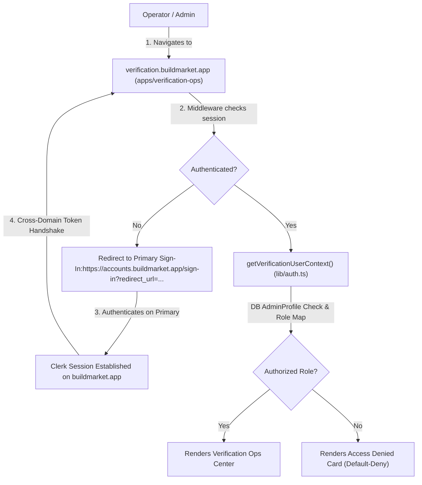

# Staff Architecture Guide: Setting Up `apps/verification-ops` as a Vercel Satellite App

This document provides a staff-level technical blueprint and step-by-step setup guide for deploying `apps/verification-ops` to Vercel as a **Clerk Satellite Application** under the primary identity domain (`buildmarket.app`).

---

## Executive Summary & Architecture Overview

### Topology & Identity Model

`apps/verification-ops` operates as a dedicated operational micro-frontend. It shares identity infrastructure with `apps/client` (primary domain) and `apps/admin` (admin satellite).

- **Primary Domain (Canonical Session):** `https://buildmarket.app` (`apps/client`)
- **Admin Satellite Domain:** `https://admin.buildmarket.app` (`apps/admin`)
- **Verification Ops Satellite Domain:** `https://verification.buildmarket.app` (`apps/verification-ops`)

### Core Invariants & Defect Prevention

1. **No Local Sign-In UI:** Satellite apps MUST NOT render local `<SignIn />` forms. Auth handshakes occur strictly on `https://accounts.buildmarket.app/sign-in`.
2. **Absolute Primary Sign-In URL (RC-2 Fix):** `NEXT_PUBLIC_CLERK_PRIMARY_SIGN_IN_URL` MUST be an absolute URL (`https://accounts.buildmarket.app/sign-in`). Setting a relative path like `/sign-in` causes Clerk's satellite engine to loop infinitely.
3. **Dynamic Middleware Resolver (RC-4 Fix):** `middleware.ts` uses dynamic options resolution `(req) => ({ isSatellite: true, domain: "...", signInUrl: "..." })` so edge workers resolve cross-domain parameters before Clerk internal checks run.
4. **Default-Deny Authorization Layer:** Clerk `isSatellite` only proves identity. `lib/auth.ts` (`getVerificationUserContext()`) enforces active `AdminProfile` verification and mapped operational roles (`SUPER_ADMIN`, `OPS_ADMIN`, `VERIFICATION_ADMIN`, `AUDITOR`).

---

## Blast Radius & Reversibility

- **Blast Radius:** `apps/verification-ops` deployment, Clerk production domain configuration, DNS records (`verification.buildmarket.app`), Vercel project environment variables.
- **Reversibility:** **Two-Way Door**. Disabling satellite mode (`NEXT_PUBLIC_CLERK_IS_SATELLITE=false`) instantly falls back to standalone authentication for local development or isolated testing.

---

## Architectural Alignment

- **ADR-001 (Auth Model):** Aligns with multi-app identity sharing via Clerk satellite architecture.
- **ADR-ADMIN-001 (Admin Auth & Freshness):** Preserves `AdminProfile.isActive` database state verification in addition to Clerk runtime identity.
- **ADR-004 (Env Strategy):** Enforces fail-fast environment validation via `lib/infrastructure/env.ts` during server startup (`instrumentation.ts`).

---

## Constraints & Invariants

- `NEXT_PUBLIC_CLERK_IS_SATELLITE` must be string `"true"` in Vercel.
- `NEXT_PUBLIC_CLERK_DOMAIN` must be hostname without protocol (e.g. `verification.buildmarket.app`).
- `NEXT_PUBLIC_CLERK_PRIMARY_SIGN_IN_URL` must be absolute (e.g. `https://accounts.buildmarket.app/sign-in`).
- `CLERK_SECRET_KEY` and `DATABASE_URL` are server-only secrets (never prefixed with `NEXT_PUBLIC_`).

---

## Step-by-Step Setup Plan for Vercel Deployment

### Step 1: Register Satellite Domain in Clerk Dashboard

1. Log in to the [Clerk Dashboard](https://dashboard.clerk.com).
2. Select the production application instance shared with `apps/client` (`buildmarket.app`).
3. Navigate to **Configure** $\rightarrow$ **Domains**.
4. Click **Add Satellite Domain**.
5. Enter the satellite domain: `verification.buildmarket.app`.
6. Select primary domain: `buildmarket.app`.
7. Save changes and copy the satellite domain configuration details.

---

### Step 2: Create New Vercel Project

1. Log in to [Vercel Dashboard](https://vercel.com).
2. Click **Add New...** $\rightarrow$ **Project**.
3. Import the `build-market` monorepo repository.
4. Configure Project Settings:
   - **Project Name:** `buildmarket-verification-ops`
   - **Framework Preset:** `Next.js`
   - **Root Directory:** `apps/verification-ops`
   - **Build Command:** `pnpm tsc --build tsconfig.json && pnpm run build`
   - **Output Directory:** `.next`
   - **Install Command:** `pnpm install`

---

### Step 3: Configure Environment Variables in Vercel

In the project **Settings** $\rightarrow$ **Environment Variables**, configure the following variables for **Production** and **Preview** environments:

| Environment Variable                    | Value                                      | Scope         | Notes                                         |
| :-------------------------------------- | :----------------------------------------- | :------------ | :-------------------------------------------- |
| `NEXT_PUBLIC_CLERK_PUBLISHABLE_KEY`     | `pk_live_...`                              | Public        | Shared Clerk Publishable Key                  |
| `CLERK_SECRET_KEY`                      | `sk_live_...`                              | Server Secret | Shared Clerk Secret Key                       |
| `NEXT_PUBLIC_CLERK_IS_SATELLITE`        | `true`                                     | Public        | Enables Satellite Mode                        |
| `NEXT_PUBLIC_CLERK_DOMAIN`              | `verification.buildmarket.app`             | Public        | Satellite Hostname (no `https://`)            |
| `NEXT_PUBLIC_CLERK_PRIMARY_SIGN_IN_URL` | `https://accounts.buildmarket.app/sign-in` | Public        | **CRITICAL:** Absolute URL to primary sign-in |
| `NEXT_PUBLIC_CLERK_SIGN_IN_URL`         | `/sign-in`                                 | Public        | Local route gate fallback                     |
| `DATABASE_URL`                          | `postgresql://...`                         | Server Secret | Production Postgres connection string         |
| `NEXT_PUBLIC_VERIFICATION_OPS_URL`      | `https://verification.buildmarket.app`     | Public        | Canonical app URL                             |

> [!CAUTION]
> **Do not omit `NEXT_PUBLIC_CLERK_PRIMARY_SIGN_IN_URL` or use a relative path `/sign-in`.**
> A relative URL causes satellite requests to loop indefinitely between the middleware and Clerk's auth handler.

---

### Step 4: Configure Subdomain DNS & Domain Binding

1. In Vercel Project Settings, navigate to **Domains**.
2. Add Custom Domain: `verification.buildmarket.app`.
3. Add CNAME record to your DNS Provider (e.g. Cloudflare / Route53):
   - **Type:** `CNAME`
   - **Name:** `verification`
   - **Target:** `cname.vercel-dns.com`
   - **TTL:** `Auto` / `300`
4. Wait for Vercel SSL Certificate provisioning to complete.

---

### Step 5: Smoke Test Cross-Domain Auth Handshake

Perform the following verification sequence in an Incognito browser window:

1. **Unauthenticated Access:**
   - Navigate directly to `https://verification.buildmarket.app`.
   - **Expected:** Immediate HTTP 307 redirect to `https://accounts.buildmarket.app/sign-in?redirect_url=https%3A%2F%2Fverification.buildmarket.app%2F`.

2. **Primary Authentication:**
   - Log in on `https://accounts.buildmarket.app/sign-in` with an authorized admin account.
   - **Expected:** Successful sign-in and seamless cross-domain redirect back to `https://verification.buildmarket.app`.

3. **Default-Deny Access Control:**
   - Log in with a standard non-admin account (e.g., client or professional).
   - Navigate to `https://verification.buildmarket.app`.
   - **Expected:** Renders the "Access Denied" card with a **Sign Out & Switch Account** action. No verification cases or operational metrics are exposed.

4. **Direct `/sign-in` Navigation:**
   - Navigate to `https://verification.buildmarket.app/sign-in`.
   - **Expected:** Immediate redirect to `https://accounts.buildmarket.app/sign-in` (no local sign-in form rendered).

---

## Validation & Rollback Plan

### Validation Checklist

- [ ] `pnpm tsc --build tsconfig.json` builds cleanly in Vercel build logs.
- [ ] SSL certificate active on `verification.buildmarket.app`.
- [ ] Environment validation (`lib/infrastructure/env.ts`) passes at boot.
- [ ] Unauthenticated requests redirect to `https://accounts.buildmarket.app/sign-in`.
- [ ] Authorized `AdminProfile` users access the Verification Operations Center.

### Rollback Strategy

If satellite auth handshake fails in production:

1. Set `NEXT_PUBLIC_CLERK_IS_SATELLITE=false` in Vercel Project Environment Variables.
2. Redeploy the project.
3. The app will temporarily fall back to local authentication mode while cross-domain configuration is investigated.
