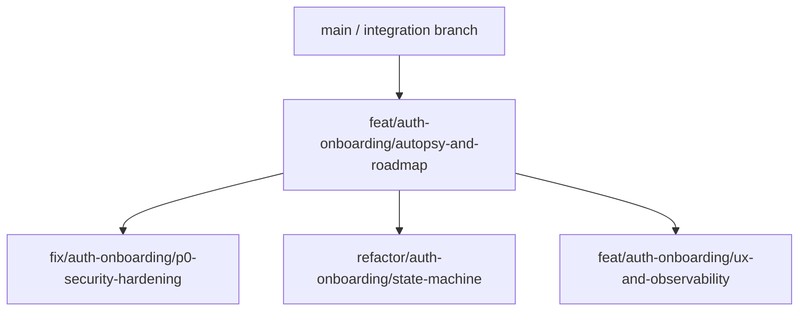

# Auth & Onboarding System Autopsy & Production Readiness Report

## Executive Summary

- **Overall Production Readiness Score**: **72%**
- **Critical Vulnerabilities / Defects**: **4 P0/P1 findings**
- **Architectural Debt Rating**: **Medium-High**
- **Key Recommendation**: The system has several strong production patterns already (Clerk-managed identity, signed webhook verification, CSP nonce generation, Prisma transactions, domain orchestration, idempotency service, and middleware onboarding gates). However, the auth/onboarding boundary must be hardened before high-scale production by fixing server-action CSRF coverage, replacing deterministic onboarding idempotency with request-scoped atomic locking, closing public API-route exposure gaps in middleware assumptions, and making Clerk/DB finalization recoverable with an explicit outbox.

### Highest-Impact Findings

1. **Server action CSRF guard is bypassed for onboarding actions** because `secureAction({ requireActor: false })` skips `validateTrustedMutationOriginForServerAction`; onboarding then depends on Clerk session cookies and recent-auth claims but not a trusted mutation origin.
2. **Onboarding idempotency is deterministic per user + role, not per submitted attempt**, creating poor replay semantics and causing same-role form edits after a failure/completion to collide with stale responses.
3. **Middleware treats `/api(.*)` as public**, so all API route protection must be perfect locally. Many routes do use internal guards, but the perimeter model is brittle and violates defense-in-depth.
4. **Clerk metadata finalization occurs after DB commit** and failures return retryable errors, but there is no durable outbox/reconciler guaranteeing eventual claim synchronization.

## System Architecture & State Machine Diagram

```mermaid
flowchart TD
  A[Unauthenticated visitor] --> B{Public route?}
  B -- /sign-in or /sign-up --> C[Clerk hosted widget]
  C --> D[Clerk user/session created]
  D --> E[/api/clerk-webhook user.created/session.created]
  E --> F[Upsert/sync app User record]
  A --> G{Protected route requested}
  G -- no Clerk userId --> H[Redirect /sign-in?redirect_url=pathname]
  H --> C
  G -- userId present --> I[Parse Clerk session metadata]
  I --> J{metadata has isOnboarded?}
  J -- yes --> K[Use high-confidence metadata]
  J -- no --> L[Call /api/internal/user-status with x-internal-secret]
  L -- ok --> M[Use DB-derived medium-confidence status]
  L -- error/missing secret --> N[Fallback status: not onboarded]
  K --> O{Blocked status?}
  M --> O
  N --> O
  O -- SUSPENDED/BANNED/DEACTIVATED/ARCHIVED --> P[/unauthorized-sign-in]
  O -- allowed --> Q{Onboarded?}
  Q -- no/indeterminate --> R[/onboarding]
  R --> S[Client role selection + form]
  S --> T[submitOnboarding/skip* server action]
  T --> U[Zod parse + recent auth + rate limit]
  U --> V[Idempotency checkOrCreate]
  V -- pending --> W[409 request processing]
  V -- completed --> X[Replay stored response]
  V -- new --> Y[Domain onboarding orchestration]
  Y --> Z[Pre-materialize uploads outside DB transaction]
  Z --> AA[Prisma transaction: upsert User/Profile/Licenses/Documents]
  AA --> AB[Optional side-effects: stores/properties]
  AB --> AC[Finalize Clerk public/session metadata]
  AC -- success --> AD[Mark idempotency COMPLETED]
  AC -- failure --> AE[Mark idempotency FAILED + show retry]
  AD --> AF[Client waits for Clerk claim refresh]
  AF -- refreshed --> AG[Dashboard / pending verification]
  AF -- stale --> AH[/auth-callback recovery]
```

## Layer-by-Layer Diagnostic Breakdown

### 1. Database & Schema Layer

#### Schema & Database Current State Architecture

- The app uses Clerk as the identity provider and maps Clerk subjects into an application `User` table via a unique `clerkId` and unique case-insensitive `email`.
- `User` stores auth-adjacent state: `role`, `status`, `isProfileComplete`, verification booleans, login counters, lockout fields, consent flags, deletion state, and `metadata` JSON.
- `ClientProfile` and `ProfessionalProfile` are one-to-one profiles keyed by `userId`; many domain relations cascade from `User`.
- `IdempotencyKey` persists mutation dedupe state with `key`, `scope`, `operation`, `status`, JSON `response`, `userId`, and TTL.
- `RefreshToken` exists with hashed token storage and revocation fields, but Clerk is the active session provider, so this model appears unused for browser sessions.

#### Schema & Database Deficiencies & Risks

- **P1: Onboarding completion invariant is split across DB and Clerk metadata.** Middleware trusts Clerk `metadata.isOnboarded` when present and only falls back to the DB when claims lack that field. If Clerk metadata becomes stale or incorrectly synchronized, route decisions can disagree with database truth.
- **P1: DB completion lacks an explicit state-machine table or transition ledger.** `User.status` and `isProfileComplete` are updated directly rather than through a transition table that records prior state, next state, actor, idempotency key, and invariant checks.
- **P1: Deterministic idempotency key is not a true request idempotency key.** The onboarding action hashes only `{domain, role}` per user. A second form submission with corrected data for the same role maps to the same key and may replay a previous response or remain locked as pending.
- **P2: `IdempotencyKey.userId` stores Clerk ID in onboarding but is named as if it stores app `User.id`.** This creates future join ambiguity and weakens query safety.
- **P2: No unique partial constraints enforce “one onboarding completion per user.”** `User.clerkId` uniqueness prevents duplicate users, and profile primary keys prevent duplicate profiles, but license/document/store/property side effects can still be duplicated outside the core profile transaction.
- **P2: Some indexed columns are redundant or low-value.** `User.clerkId` and `User.email` are unique and also indexed again, which may add write overhead.
- **P2: No durable outbox for post-transaction Clerk metadata sync.** When DB transaction succeeds and Clerk metadata update fails, the only recovery path is user retry or `/auth-callback` behavior; there is no guaranteed background reconciliation.

#### Schema & Database Root Cause Analysis

The schema has grown from entity persistence rather than from an explicit auth/onboarding state-machine model. The code relies on a composite of `User.status`, `User.isProfileComplete`, Clerk session metadata, and profile existence. That works under normal conditions, but production-grade correctness requires a single authoritative persisted transition record and durable async synchronization to external identity claims.

### 2. Identity & Auth Provider Integration

#### Identity & Auth Current State Architecture

- Clerk widgets render sign-in and sign-up UI.
- Middleware is Clerk-backed via `clerkMiddleware`.
- Webhooks use Svix signature verification, body-size limits, timestamp freshness checks, Redis replay suppression, and event-type dispatch.
- Onboarding finalization writes Clerk metadata after DB onboarding completes.

#### Identity & Auth Deficiencies & Risks

- **P0: Recent-auth enforcement is present but no server-action trusted-origin check runs for onboarding.** `submitOnboarding`, `skipOnboarding`, and `skipProfessionalOnboarding` pass `requireActor: false`; `secureAction` currently performs CSRF origin validation only in the `requireActor !== false` path.
- **P1: Webhook rate limiting is post-verification and IP-scoped.** This is preferable to pre-verification lockout but can still be noisy behind shared egress. Add delivery/source scoping and explicit Svix event-id telemetry.
- **P1: MFA policy is configuration-only at the app layer.** `SystemSettings.securityMFA` exists, but middleware does not enforce MFA/freshness for admin/professional high-risk routes based on Clerk factors.
- **P2: Session revocation and token rotation are delegated to Clerk without app-level incident hooks.** This is acceptable if documented, but admin suspend/ban should actively revoke Clerk sessions.

#### Identity & Auth Root Cause Analysis

Identity responsibilities are partly delegated to Clerk and partly mirrored in app data. The system has good webhook hygiene, but high-value mutation semantics were implemented through the generic action wrapper path that accidentally bypasses trusted-origin checks when no DB actor is resolved.

### 3. API & Request Layer

#### API Layer Current State Architecture

- API responses use helpers such as `apiError`/`apiSuccess` and correlation IDs in several routes.
- Internal `/api/internal/user-status` is protected by `x-internal-secret` and rate limited.
- Onboarding server actions use Zod validation through `OnboardingSchema`, recent auth, and rate limiting.
- The API layer contains many route-local guards; middleware marks all `/api(.*)` as public.

#### API Layer Deficiencies & Risks

- **P1: Middleware public API classification is too broad.** Treating all API routes as public means every route must independently remember auth, CSRF, rate limiting, and input validation. One missed guard becomes a production vulnerability.
- **P1: Error messages may expose internal failures to clients.** `secureAction` maps unexpected `Error.message` into an `internal` client-visible failure. This can leak implementation detail from thrown errors.
- **P2: Internal endpoint accepts raw `clerkId` query without schema validation.** It checks presence, but should enforce shape/length and return a generic envelope.
- **P2: Rate limiting is per authenticated Clerk ID for onboarding, not per IP + user + device.** This is reasonable for logged-in actions but incomplete for sign-up/sign-in/password-reset, which are Clerk-managed and should be explicitly configured at Clerk/WAF/CDN level.

#### API Layer Root Cause Analysis

The codebase has strong abstractions but inconsistent perimeter philosophy. Route protection is decentralized into route handlers and server actions, while middleware only gates page routes. This is workable but not staff-level defense-in-depth unless backed by a route protection matrix test suite.

### 4. Domain & Business Logic Layer

#### Domain Layer Current State Architecture

- Onboarding uses a shared orchestration service with `Result<T,E>` envelopes.
- User/profile writes run in Prisma transactions, with upload materialization intentionally performed before transactions to avoid long-held DB locks.
- Store/property creation is performed after profile completion and returned as non-fatal warnings.
- Clerk claim finalization is separated into a shared metadata helper.

#### Domain Layer Deficiencies & Risks

- **P1: Side-effect resources are outside the onboarding transaction and not idempotency-keyed by resource.** Store/property creation can partially fail or duplicate under retry if profile completion succeeds but side-effect creation is retried by a different path.
- **P1: Existing completion guard is read-before-write, not atomic.** The service checks `existingUser.isProfileComplete` before transaction, but the transaction itself does not conditionally update only from incomplete states. Concurrent submissions can both pass the precheck.
- **P2: Professional skip creates a minimally valid public-ish profile with `companyName: ""` and `profession: OTHER`.** This avoids fake data but should not be visible to search/discovery until completion/verification state allows it.
- **P2: Audit trail coverage is not consistent for auth lifecycle events.** Admin compliance actions write audit logs elsewhere, but onboarding completion, login failures, MFA events, and claim sync failures do not appear as immutable audit events.

#### Domain Layer Root Cause Analysis

The service has been carefully refactored for resilience, but it still mixes transactional state changes, external storage materialization, optional domain side effects, and external Clerk metadata synchronization in one synchronous request. That makes partial failure recovery difficult without an outbox and state-transition table.

### 5. Edge & Middleware Layer

#### Edge & Middleware Current State Architecture

- Middleware generates CSP nonces and applies CSP headers.
- It performs maintenance-mode checks, registration gating, blocked-user gating, onboarding gating, pending-verification routing, and role routing.
- It falls back to `/api/internal/user-status` when Clerk metadata lacks onboarding claims.

#### Edge & Middleware Deficiencies & Risks

- **P1: `redirect_url` only stores pathname, losing query/hash and reducing UX.** It avoids open redirects, but users deep-linking with query parameters are not returned precisely.
- **P1: Protected route list omits some authenticated-looking pages.** `/dashboard` under `(user)` is present in the app tree but `isProtectedRoute` does not include `/dashboard(.*)`.
- **P2: Middleware fetches internal user status from the same origin during routing.** This adds latency and creates a dependency loop; failure resolves to not-onboarded and can trap users if Clerk metadata is missing and the internal endpoint is degraded.
- **P2: API routes are skipped from auth gating by `isPublicRoute` even though matcher runs on APIs.** This is explicit, but easy to misunderstand and should be documented/tested as a route matrix.

#### Edge & Middleware Root Cause Analysis

Middleware is doing many jobs: security headers, feature flags, maintenance, auth, onboarding, role routing, and fallback data access. Combining these concerns increases complexity and makes redirect-loop and latency analysis harder.

### 6. Client & Presentation Layer

#### Client & Presentation Current State Architecture

- Sign-in/sign-up pages wrap Clerk widgets with branded UX and legal links.
- Onboarding is a client page with role selection, URL-backed step/role state, toast error handling, claim-refresh wait, and auth-callback fallback.
- `sessionStorage` draft cleanup exists, but the inspected hook does not itself persist active form fields.
- No-JS onboarding pages exist as progressive enhancement fallback.

#### Client & Presentation Deficiencies & Risks

- **P2: Multi-step input persistence is incomplete in the hook.** The step and role are URL-backed, but typed profile fields are not preserved by the hook across reload/network drops.
- **P2: Error UX collapses structured action failures to one toast.** Rate limit retry-after, stale recent-auth, idempotency pending, and Clerk sync retry all need specific UX.
- **P2: Multi-tab synchronization depends on Clerk metadata refresh but lacks BroadcastChannel/storage event coordination.** Tab B may remain stale until navigation or manual refresh.
- **P3: Accessibility must remain continuously tested.** A11y tests exist, but onboarding form controls should be explicitly checked for field-level `aria-describedby`, focus restoration, and error summaries.

#### Client & Presentation Root Cause Analysis

The UI handles the happy path and some claim propagation failure, but production onboarding must be designed as a resumable workflow with durable local draft state, structured error mapping, and cross-tab state invalidation.

## Production-Readiness Risk Matrix

| Risk ID  | Component          | Failure Scenario                                                                                                     | Impact                                                                         | Severity (P0-P3) | Reversibility                                                        |
| -------- | ------------------ | -------------------------------------------------------------------------------------------------------------------- | ------------------------------------------------------------------------------ | ---------------- | -------------------------------------------------------------------- |
| AUTH-001 | Server Actions     | Cross-site form/action post uses authenticated Clerk session because onboarding skips trusted-origin CSRF validation | Unauthorized profile role/status mutation                                      | P0               | Reversible with origin enforcement; audit needed                     |
| AUTH-002 | Idempotency        | Same user submits changed onboarding payload with same deterministic key                                             | Stale replay, stuck pending, or incorrect UX                                   | P1               | Reversible by adding request idempotency header and transition table |
| AUTH-003 | Domain Transaction | Two concurrent submissions pass pre-transaction completion guard                                                     | Duplicate side effects, inconsistent warnings                                  | P1               | Partially reversible; resource dedupe/migration required             |
| AUTH-004 | Clerk Sync         | DB commit succeeds but Clerk metadata update fails                                                                   | Redirect loops or blocked dashboard access                                     | P1               | Reversible with outbox reconciliation                                |
| AUTH-005 | Middleware         | `/api(.*)` globally public with route-local guard dependence                                                         | Any missed API guard becomes exposure                                          | P1               | Reversible with route matrix and middleware API policy               |
| AUTH-006 | Routing            | `/dashboard` not in protected matcher                                                                                | Potential unauthenticated access to dashboard page depending page-level guards | P1               | Reversible by matcher update                                         |
| AUTH-007 | Internal Status    | Middleware same-origin internal fetch degrades                                                                       | Users trapped in onboarding on API failure                                     | P2               | Reversible with cache/claim design                                   |
| AUTH-008 | Observability      | Missing immutable audit events for auth/onboarding lifecycle                                                         | Weak incident reconstruction                                                   | P2               | Reversible by adding audit/outbox events                             |
| AUTH-009 | UX                 | No durable form-field draft persistence                                                                              | User loses work during reload/network drop                                     | P2               | Reversible with encrypted/session draft strategy                     |
| AUTH-010 | Redirect           | Sign-in redirect preserves only pathname                                                                             | Lost deep-link query context                                                   | P3               | Reversible with same-origin returnTo helper                          |

## Detailed Proposed Improvements & Refactors

### 1. Database Schema & Migration Updates

#### Add explicit onboarding state and transition ledger

```prisma
// packages/db/prisma/schema.prisma

enum OnboardingWorkflowState {
  NOT_STARTED
  ROLE_SELECTED
  PROFILE_SUBMITTED
  COMPLETED
  PENDING_VERIFICATION
  FAILED_RETRYABLE
}

model OnboardingState {
  userId          String                  @id
  user            User                    @relation(fields: [userId], references: [id], onDelete: Cascade)
  state           OnboardingWorkflowState @default(NOT_STARTED)
  role            UserRole?
  currentStep     Int                     @default(1)
  completedAt     DateTime?
  lastErrorCode   String?
  version         Int                     @default(0)
  createdAt       DateTime                @default(now())
  updatedAt       DateTime                @updatedAt
  transitions     OnboardingTransition[]

  @@index([state, role])
  @@index([updatedAt])
}

model OnboardingTransition {
  id              String                  @id @default(uuid())
  userId          String
  state           OnboardingState         @relation(fields: [userId], references: [userId], onDelete: Cascade)
  idempotencyKey  String                  @unique
  fromState       OnboardingWorkflowState
  toState         OnboardingWorkflowState
  actorClerkId    String
  correlationId   String
  reason          String?
  createdAt       DateTime                @default(now())

  @@index([userId, createdAt])
  @@index([actorClerkId, createdAt])
}

model AuthOutboxEvent {
  id             String   @id @default(uuid())
  aggregateType  String
  aggregateId    String
  eventType      String
  payload        Json     @db.JsonB
  status         String   @default("PENDING")
  attempts       Int      @default(0)
  nextAttemptAt  DateTime @default(now())
  createdAt      DateTime @default(now())
  updatedAt      DateTime @updatedAt

  @@index([status, nextAttemptAt])
  @@index([aggregateType, aggregateId])
}
```

#### Harden idempotency ownership semantics

```diff
 model IdempotencyKey {
   id         String            @id @default(uuid())
   key        String            @unique
   scope      String
   operation  String
   status     IdempotencyStatus
   response   Json?             @db.JsonB
-  userId     String
+  actorClerkId String
+  appUserId    String?
   expiresAt  DateTime
   createdAt  DateTime          @default(now())

-  @@index([key, scope])
+  @@index([scope, actorClerkId, status])
+  @@index([appUserId])
   @@index([expiresAt])
 }
```

#### Atomic completion update pattern

```ts
const updated = await tx.user.updateMany({
  where: {
    clerkId: actor.clerkId,
    isProfileComplete: false,
    status: { in: ["ONBOARDING"] },
  },
  data: {
    role: userRole,
    status: userRole === "PROFESSIONAL" ? "PENDING_VERIFICATION" : "ACTIVE",
    isProfileComplete: true,
  },
});

if (updated.count !== 1) {
  throw new OnboardingConflictError(
    "Onboarding already completed or invalid state",
  );
}
```

### 2. API & Guard Layer Hardening

#### Ensure server-action CSRF validation always runs for mutating actions

```diff
 export async function secureAction<TInput, TParsed = TInput, TOutput = void>(
   options: SecureActionOptions<TInput, TParsed, TOutput>,
 ): Promise<ActionResult<TOutput>> {
@@
   try {
     const input = parseInput(options.schema, options.input) as TParsed;
+
+    const csrfCheck = await validateTrustedMutationOriginForServerAction(
+      options.csrf,
+    );
+    if (!csrfCheck.ok) {
+      throwActionFailure(
+        createActionFailure(
+          "forbidden",
+          mutationOriginFailureMessage(csrfCheck.reason),
+          403,
+        ),
+      );
+    }
+
     if (options.requireActor === false) {
       actor = null;
@@
-    } else {
-      const csrfCheck = await validateTrustedMutationOriginForServerAction(
-        options.csrf,
-      );
-
-      if (!csrfCheck.ok) {
-        throwActionFailure(...);
-      }
-
+    } else {
       authResult = await auth();
```

#### Sanitize internal errors returned to clients

```diff
- : createActionFailure(
-     "internal",
-     error instanceof Error
-       ? error.message || "Unexpected server action error"
-       : "Unexpected server action error",
-     500,
-   ));
+ : createActionFailure(
+     "internal",
+     "Unexpected server action error",
+     500,
+   ));
```

#### Replace broad public API assumption with route matrix

```ts
const PUBLIC_API_ROUTES = [
  "/api/health(.*)",
  "/api/settings/public(.*)",
  "/api/newsletter/confirm(.*)",
  "/api/clerk-webhook",
] as const;

export const isPublicApiRoute = createRouteMatcher(PUBLIC_API_ROUTES);
export const isProtectedApiRoute = createRouteMatcher([
  "/api/user(.*)",
  "/api/onboarding(.*)",
  "/api/professional-portal(.*)",
]);
```

### 3. Domain Service & State Machine Refactoring

#### Request-scoped idempotency key

```ts
const ClientIdempotencySchema = z.string().uuid();

function resolveOnboardingIdempotencyKey(clerkId: string, clientKey: string) {
  return IdempotencyService.generateKey(clerkId, "POST", {
    domain: "onboarding",
    clientKey,
  });
}
```

Client call:

```ts
const idempotencyKey = crypto.randomUUID();
await onboardingClient.submit(data, { idempotencyKey });
```

#### Durable outbox for Clerk metadata sync

```ts
await tx.authOutboxEvent.create({
  data: {
    aggregateType: "User",
    aggregateId: dbUser.id,
    eventType: "CLERK_ONBOARDING_METADATA_SYNC_REQUESTED",
    payload: {
      clerkId: actor.clerkId,
      role: userRole,
      isOnboarded: true,
      status: targetStatus,
      correlationId: actor.correlationId,
    },
  },
});
```

Worker:

```ts
export async function processAuthOutboxEvent(event: AuthOutboxEvent) {
  const payload = ClerkOnboardingSyncPayload.parse(event.payload);
  await finalizeClerkOnboardingTransition({
    clerkId: payload.clerkId,
    metadata: {
      role: payload.role,
      isOnboarded: payload.isOnboarded,
      status: payload.status,
    },
    context: {
      correlationId: payload.correlationId,
      operation: "auth_outbox_clerk_metadata_sync",
    },
  });
}
```

### 4. Middleware & Routing Fixes

#### Include all dashboard routes and preserve safe return URLs

```diff
 export const isProtectedRoute = createRouteMatcher([
+  "/dashboard(.*)",
   "/homeowner-dashboard(.*)",
   "/professional-portal(.*)",
   "/messages(.*)",
   "/profile(.*)",
   "/client(.*)",
 ]);
```

```ts
export function safeReturnTo(req: NextRequest): string {
  const url = req.nextUrl;
  return `${url.pathname}${url.search}`;
}

export function redirectToSignIn(req: NextRequest): NextResponse {
  const signInUrl = new URL(CLIENT_ROUTES.signIn, req.url);
  signInUrl.searchParams.set("redirect_url", safeReturnTo(req));
  return NextResponse.redirect(signInUrl);
}
```

### 5. Client Form & UX Updates

#### Persist non-sensitive draft fields in session storage

```ts
const DRAFT_KEY = "onboarding_profile_draft_v1";
const SENSITIVE_KEYS = new Set([
  "kraPin",
  "licenseNumber",
  "nationalId",
  "password",
]);

function redactDraft(data: Record<string, unknown>) {
  return Object.fromEntries(
    Object.entries(data).filter(([key]) => !SENSITIVE_KEYS.has(key)),
  );
}

export function saveOnboardingDraft(data: Record<string, unknown>) {
  sessionStorage.setItem(DRAFT_KEY, JSON.stringify(redactDraft(data)));
}

export function loadOnboardingDraft() {
  const raw = sessionStorage.getItem(DRAFT_KEY);
  return raw ? JSON.parse(raw) : null;
}
```

#### Cross-tab completion broadcast

```ts
const channel = new BroadcastChannel("auth-onboarding");
channel.postMessage({ type: "ONBOARDING_COMPLETED", role: result.data.role });

channel.onmessage = (event) => {
  if (event.data?.type === "ONBOARDING_COMPLETED") {
    router.refresh();
    router.replace(dashboardForRole(event.data.role));
  }
};
```

#### Structured error UX

```ts
function onboardingErrorMessage(error: ActionFailure): string {
  switch (error.code) {
    case "limit_exceeded":
      return `Too many attempts. Try again in ${error.details?.retryAfterSeconds ?? 60}s.`;
    case "unauthorized":
      return "Please re-authenticate to complete onboarding.";
    case "conflict":
      return "Onboarding is already complete or currently processing in another tab.";
    default:
      return error.message || "Onboarding failed. Please try again.";
  }
}
```

## Implementation & Migration Roadmap

### Sub-Branch Breakdown for the Implementation Roadmap

Once the autopsy report is finalized and approved, break down execution into isolated, single-responsibility sub-branches matching the phased delivery plan:



### Mandatory Phase Exit Criteria & Governance

For **every phase implementation** (`Phase 1`, `Phase 2`, `Phase 3`), a sub-branch PR or merge is NOT complete until all of the following exit criteria are executed and verified clean:

1. **Targeted Test Suite Verification**:
   - Run targeted unit and integration tests covering all touched files, services, actions, middleware, and schemas (e.g. `pnpm exec vitest run <path/to/touched/file.test.ts>`).
2. **Static Quality & Security Checks**:
   - Run type checking across workspaces: `pnpm check-types`
   - Run linter across workspaces: `pnpm lint`
   - Run security drift checks: `pnpm check-security-drift` and `pnpm report-security-drift:strict`
3. **Documentation & Progress Synchronization**:
   - Update relevant root and app-level `CHANGELOG.md` files (`docs/CHANGELOG.md`, `apps/client/docs/CHANGELOG.md`, `apps/admin/docs/CHANGELOG.md`).
   - Update relevant progress summary documents (`docs/PROGRESS-SUMMARY.md`, `apps/admin/docs/PROGRESS-SUMMARY.md`).
4. **Staff-Level Commit & Remote Push**:
   - Format a structured staff-level commit message adhering to Conventional Commits with context, invariants, and verification.
   - Sign the commit using GPG/OpenPGP key `D723DC268434EF4D` (`Don Shammah <donshammah1@gmail.com>`) when GPG signing is enabled.
   - Push to `origin` tracking branch (`git push -u origin <phase-branch-name>`).

---

### Staff-Level Git Commit & Push Protocol

Upon completing a phase implementation and passing all exit gates, execute the following commit and push procedure:

#### Step 1: Structure the Staff-Level Commit Message

Write a conventional commit message with a detailed body explaining **Why**, **What**, **Invariants Maintained**, and **Verification Evidence**:

```text
<type>(<scope>): <concise staff-level summary (max 72 chars)>

[Intent & Business Rationale]
Detailed explanation of why this change was made and what security vulnerability or architectural flaw was remediated.

[Architectural Changes & Invariants]
- List of specific schema, middleware, service, or API action modifications.
- State invariants preserved (e.g., thin adapters, atomic transactions, no PII logging).

[Verification & Quality Evidence]
- Targeted Vitest suite results (e.g., 14/14 tests passing).
- Static analysis pass: pnpm check-types, pnpm lint, pnpm check-security-drift.
- Documentation synced: CHANGELOG.md and PROGRESS-SUMMARY.md updated.

Co-authored-by: Don Shammah <donshammah1@gmail.com>
```

#### Step 2: Example Commit Messages by Phase

- **Phase 1 Commit Example**:

  ```bash
  git commit -m "fix(auth): harden server-action CSRF origin validation and onboarding idempotency

  [Intent & Business Rationale]
  Remediates P0 CSRF origin bypass for unauthenticated onboarding actions by enforcing origin validation outside the requireActor check. Replaces deterministic idempotency keys with request-scoped client UUIDs to prevent stale replay attacks.

  [Architectural Changes & Invariants]
  - Enforced validateTrustedMutationOriginForServerAction across all secureAction paths.
  - Added /dashboard(.*) to protected route matcher.
  - Sanitized unexpected server action error envelopes to prevent internal trace leakage.

  [Verification & Quality Evidence]
  - Targeted tests: vitest run app/lib/actions/__tests__/onboarding.test.ts (PASS)
  - Static checks: check-types, lint, report-security-drift:strict (PASS)
  - Documentation: updated docs/CHANGELOG.md and docs/PROGRESS-SUMMARY.md"
  ```

- **Phase 2 Commit Example**:

  ```bash
  git commit -m "refactor(auth): implement onboarding transition table and outbox metadata sync

  [Intent & Business Rationale]
  Establishes a single authoritative database transition ledger for onboarding state changes and introduces an asynchronous outbox worker for Clerk metadata synchronization.

  [Architectural Changes & Invariants]
  - Added OnboardingState, OnboardingTransition, and AuthOutboxEvent Prisma models.
  - Converted synchronous Clerk metadata update to durable event outbox.
  - Added immutable audit trail logging for USER_REGISTERED and ONBOARDING_COMPLETED events.

  [Verification & Quality Evidence]
  - Targeted tests: vitest run src/lib/domains/auth/__tests__/outbox.test.ts (PASS)
  - Static checks: check-types, lint, report-security-drift:strict (PASS)
  - Documentation: updated apps/client/docs/CHANGELOG.md and apps/admin/docs/PROGRESS-SUMMARY.md"
  ```

#### Step 3: OpenPGP Commit Signing & Remote Push

```bash
# Optional: Ensure GPG signing is configured for key D723DC268434EF4D (Ed25519)
git config user.name "Don Shammah"
git config user.email "donshammah1@gmail.com"
git config user.signingkey D723DC268434EF4D

# Stage changes (use -f if path is ignored by root .gitignore, e.g., docs/...)
git add -f <touched-files> docs/CHANGELOG.md docs/PROGRESS-SUMMARY.md

# Commit (add -S for signed commit)
git commit -S -m "<type>(<scope>): <summary>"

# Push branch to remote origin
git push -u origin <phase-branch-name>
```

---

### Phase 1: P0 Security & Data Corruption Blockers

- Move server-action CSRF origin validation outside the `requireActor` branch.
- Add `/dashboard(.*)` to protected route matcher and introduce a tested API route matrix.
- Replace deterministic onboarding idempotency with client-supplied UUID keys and atomic `createMany`/unique conflict handling.
- Sanitize unexpected server-action error messages.
- Add tests for concurrent onboarding submissions and CSRF rejection.
- **Phase Exit Gate**: Pass targeted vitest tests on touched files; pass `pnpm check-types`, `pnpm lint`, and `pnpm check-security-drift` / `pnpm report-security-drift:strict`; update `CHANGELOG.md` and `PROGRESS-SUMMARY.md`; commit with staff-level message and push to `origin`.

### Phase 2: Architectural Alignment & State Machine Refactoring

- Add `OnboardingState`, `OnboardingTransition`, and `AuthOutboxEvent` tables.
- Refactor onboarding completion into explicit transition functions with conditional updates.
- Move Clerk metadata sync to outbox-backed eventual consistency.
- Make store/property side effects idempotency-keyed by onboarding transition ID.
- Add immutable audit events for `USER_REGISTERED`, `ONBOARDING_STARTED`, `ONBOARDING_COMPLETED`, `CLERK_METADATA_SYNC_FAILED`, `LOGIN_FAILED`, `MFA_VERIFIED`, and `SESSION_REVOKED`.
- **Phase Exit Gate**: Pass targeted vitest tests on touched files; pass `pnpm check-types`, `pnpm lint`, and `pnpm check-security-drift` / `pnpm report-security-drift:strict`; update `CHANGELOG.md` and `PROGRESS-SUMMARY.md`; commit with staff-level message and push to `origin`.

### Phase 3: Observability, UX Polish & Edge-Case Resilience

- Add route-protection matrix tests for public/protected/onboarding/professional/pending-verification routes.
- Add BroadcastChannel-based multi-tab sync.
- Persist non-sensitive draft data with explicit sensitive-key redaction.
- Add user-facing retry-after and recent-auth remediation screens.
- Add SLO dashboards for onboarding completion rate, webhook replay rejects, Clerk sync lag, middleware fallback rate, and redirect-loop detection.
- **Phase Exit Gate**: Pass targeted vitest tests on touched files; pass `pnpm check-types`, `pnpm lint`, and `pnpm check-security-drift` / `pnpm report-security-drift:strict`; update `CHANGELOG.md` and `PROGRESS-SUMMARY.md`; commit with staff-level message and push to `origin`.

## Verification & Testing Strategy

### Required Automated Tests

- **Unit tests**
  - `OnboardingState` transition table rejects invalid transitions.
  - `IdempotencyService` rejects scope reuse and handles expired keys atomically.
  - `safeReturnTo` preserves same-origin path/query and rejects absolute external URLs.
  - `secureAction` rejects untrusted origins for both `requireActor: true` and `requireActor: false`.
- **Integration tests**
  - Two simultaneous `submitOnboarding` calls: exactly one transition completes; the other receives 409 or replay.
  - DB commit succeeds and Clerk sync fails: outbox event is created and worker reconciles metadata.
  - `/api/internal/user-status` rejects missing/invalid secrets and invalid Clerk ID shape.
  - Middleware redirects incomplete users to `/onboarding` and completed users away from `/onboarding`.
- **E2E tests**
  - Full client sign-up → onboarding → dashboard.
  - Professional sign-up → onboarding → pending verification.
  - Suspended user session → unauthorized sign-in landing and sign-out.
  - Deep link to protected route with query → sign-in → onboarding → original route if allowed.
- **Chaos scenarios**
  - Drop network after profile DB transaction but before Clerk metadata sync.
  - Redis idempotency/replay store unavailable during webhook and onboarding.
  - User completes onboarding in Tab A while Tab B remains on step 2.
  - Upload materialization succeeds but document insert fails.
  - Internal user-status endpoint times out while Clerk metadata is absent.

## Final Production Gate

Do not declare the auth/onboarding funnel production-ready until:

1. P0/P1 items in this report are fixed and covered by tests.
2. Auth route/API route matrix is explicit, versioned, and tested in CI.
3. Onboarding finalization is recoverable through a durable outbox.
4. Security events are auditable without exposing Class A/B sensitive values.
5. All targeted unit/integration tests on touched files pass cleanly.
6. All static checks pass cleanly across every phase (`pnpm check-types`, `pnpm lint`, `pnpm check-security-drift`, and `pnpm report-security-drift:strict`).
7. Relevant `CHANGELOG.md` and `PROGRESS-SUMMARY.md` files are fully updated for all implemented phases.
8. Every phase commit follows Conventional Commits with staff-level context, is signed (OpenPGP key `D723DC268434EF4D`), and pushed to `origin`.
9. Manual QA verifies sign-in, sign-up, onboarding, pending verification, blocked account, multi-tab, reload, and network-failure paths.
