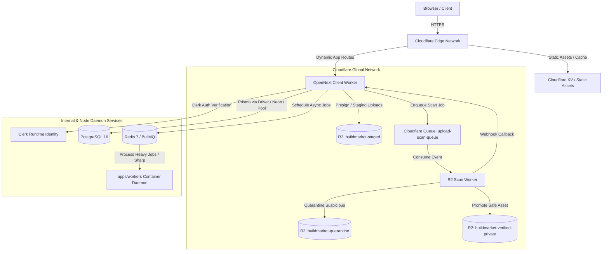

# Cloudflare Workers & OpenNext Runbook

> **Target Service:** `apps/client` (Next.js 16 App Router on OpenNext) & `apps/client/workers` (R2 Malware Scan Worker)  
> **Runtime Environment:** Cloudflare Workers (`workerd` V8 WebAssembly/JS Isolates)  
> **Live Staging Endpoint:** `https://build-market-client-staging.donshammah1.workers.dev`  
> **Live Production Endpoint:** `https://build-market-client-production.donshammah1.workers.dev`  
> **R2 Storage & Queues:** `buildmarket-staged`, `buildmarket-verified-private`, `buildmarket-quarantine`, `upload-scan-queue`

---

## 1. Architecture Overview

The `apps/client` application is compiled using `@opennextjs/cloudflare` to run as a single Cloudflare Worker handling server-rendered routes, App Router API handlers, and middleware, backed by Cloudflare R2 object storage, Cloudflare Queues, and static assets hosted on Cloudflare's global edge network.



### Key Architectural Invariants

1. **V8 Isolate Execution vs Native Binaries**:
   - Cloudflare Workers executes inside `workerd` V8 WebAssembly/JS isolates.
   - Native C++ Node addons (`.node` files such as `sharp-win32-x64.node`, `canvas`, etc.) **cannot** execute inside Cloudflare Workers.
   - Any image resizing, EXIF sanitization, or CPU-heavy transformation is offloaded asynchronously to the `apps/workers` daemon or handled via pure WebAssembly / isolate-compatible fallbacks ([inline-processor.ts](file:///c:/Users/User/build-market/apps/client/app/lib/domains/uploads/inline-processor.ts)).
2. **OpenNext Static Asset Budget**:
   - Cloudflare enforces a 25 MiB uncompressed limit per individual static asset.
   - The pre-build script `node scripts/check-worker-asset-budget.mjs` verifies all assets before bundling.
3. **Queue & R2 Decoupling**:
   - The client application acts as a queue producer (`env.UPLOAD_SCAN_QUEUE`).
   - The standalone `r2-scan-worker` consumes the queue, downloads from `buildmarket-staged`, evaluates ClamAV / signature / heuristics, and promotes clean files to `buildmarket-verified-private`.

---

## 2. Secrets & Environment Configuration

### Required Production & Staging Secrets

All sensitive credentials must be set via `wrangler secret put` on the target Worker. Do not commit secret keys to repository config files.

| Secret Name             | Description                                           | Target Worker Name (`--name`)                                    |
| :---------------------- | :---------------------------------------------------- | :--------------------------------------------------------------- |
| `CLERK_SECRET_KEY`      | Clerk Backend Secret Key                              | `build-market-client-production` / `build-market-client-staging` |
| `CLERK_PUBLISHABLE_KEY` | Clerk Frontend Publishable Key                        | `build-market-client-production` / `build-market-client-staging` |
| `DD_API_KEY`            | Datadog Telemetry API Key (Direct OTLP/Log Ingestion) | `build-market-client-production` / `build-market-client-staging` |
| `DATABASE_URL`          | PostgreSQL Connection String                          | `build-market-client-production` / `build-market-client-staging` |
| `INTERNAL_API_SECRET`   | Secret for R2 Scan Worker Callback verification       | `build-market-client-production` / `r2-scan-worker-production`   |

### Setting Secrets via Wrangler CLI

```powershell
# Set Datadog Telemetry API Key for Client Worker
wrangler secret put DD_API_KEY --name build-market-client-production
wrangler secret put DD_API_KEY --name build-market-client-staging

# Set Clerk Secret Key
wrangler secret put CLERK_SECRET_KEY --name build-market-client-production
wrangler secret put CLERK_SECRET_KEY --name build-market-client-staging

# Set Clerk Publishable Key
wrangler secret put CLERK_PUBLISHABLE_KEY --name build-market-client-production
wrangler secret put CLERK_PUBLISHABLE_KEY --name build-market-client-staging
```

---

## 3. Build & Deployment Procedures

### Automated Postinstall Hooks

The repository includes [scripts/patch-opennext.mjs](file:///c:/Users/User/build-market/scripts/patch-opennext.mjs) registered in root [package.json](file:///c:/Users/User/build-market/package.json). Whenever dependencies are installed (`pnpm install`), OpenNext is automatically patched to:

- Inject `stub-sharp-plugin` to bypass native binary imports.
- Configure `loader: { ".node": "empty" }` for esbuild bundling.

### Manual Staging Deployment

To test and deploy the staging environment from the local terminal:

```powershell
# 1. Build and deploy client Next.js application to staging
wrangler deploy --config apps/client/wrangler.toml --env staging

# 2. Deploy R2 malware scan queue worker to staging (if modified)
wrangler deploy --config apps/client/workers/wrangler.toml --env staging
```

### Manual Production Deployment

```powershell
# 1. Build and deploy client Next.js application to production
wrangler deploy --config apps/client/wrangler.toml --env production

# 2. Deploy R2 malware scan queue worker to production
wrangler deploy --config apps/client/workers/wrangler.toml --env production
```

---

## 4. CI/CD Pipeline (GitHub Actions)

Continuous deployment is automated via `.github/workflows/deploy.yml` on every push to `main` or manual trigger (`workflow_dispatch`).

### Workflow Pipeline Steps

1. **Checkout & Dependency Setup**:
   - `actions/checkout@v4`
   - `pnpm/action-setup@v4`
   - `actions/setup-node@v4` with Node 24 and pnpm caching.
   - `pnpm install --frozen-lockfile` (triggers postinstall patch script).
   - `pnpm run db:generate`
   - `pnpm exec turbo run build --filter=./packages/*`
2. **Deploy Datadog Tail Forwarder Worker**:
   - Executes `wrangler deploy --env production` in `workers/dd-tail-forwarder`.
3. **Deploy Cloudflare Scan Worker**:
   - Executes `wrangler deploy --env production` in `apps/client/workers`.
4. **Build OpenNext Client App**:
   - Executes `pnpm run build:cloudflare-worker` in `apps/client`.
5. **Deploy OpenNext Client App**:
   - Executes `cloudflare/wrangler-action@v3` with `wrangler deploy --env production`.

### Required GitHub Actions Repository Secrets

Configure the following secrets in **GitHub Repository Settings -> Secrets and variables -> Actions**:

- `CLOUDFLARE_API_TOKEN`: Cloudflare API Token with `Account.Workers Scripts:Edit`, `Account.Workers KV Storage:Edit`, `Account.Workers R2 Storage:Edit`, and `Account.Workers Queues:Edit` permissions.
- `CLOUDFLARE_ACCOUNT_ID`: Cloudflare 32-character account identifier.

---

## 5. Observability, Metrics, & Monitoring

### Native Cloudflare Worker Logs & Traces

Cloudflare observability is enabled natively in [apps/client/wrangler.toml](file:///c:/Users/User/build-market/apps/client/wrangler.toml) with 100% head sampling:

```toml
[observability]
enabled = true
head_sampling_rate = 1.0

[observability.logs]
enabled = true
invocation_logs = true

[observability.traces]
enabled = true
```

To tail live real-time production invocation logs in the terminal:

```powershell
# Tail production client worker
wrangler tail build-market-client-production

# Tail staging client worker
wrangler tail build-market-client-staging

# Tail production scan worker
wrangler tail r2-scan-worker-production
```

### Datadog APM & Telemetry

Client worker runtime errors and application logs stream directly to Datadog:

- **Service Name:** `buildmarket-client`
- **Environment:** `production` / `staging`
- **Intake Endpoint:** `https://http-intake.logs.us5.datadoghq.com/v2/logs`
- **Tracing Intake:** `https://otlp-intake.us5.datadoghq.com/v1/traces`

---

## 6. Troubleshooting & Common Failure Modes

### 1. Build Error: `No loader is configured for ".node" files` or `Could not resolve require("...sharp-*.node")`

- **Cause:** Native C++ Node addon referenced in bundle tree or Next.js standalone file tracer copied `node_modules/sharp`.
- **Solution:**
  1. Ensure `serverExternalPackages: ["sharp"]` is NOT present in [apps/client/next.config.ts](file:///c:/Users/User/build-market/apps/client/next.config.ts).
  2. Verify `images: { unoptimized: true }` in `next.config.ts`.
  3. Verify `scripts/patch-opennext.mjs` was executed: `node scripts/patch-opennext.mjs`.

### 2. Deployment Error: `Asset exceeds 25.00 MiB limit`

- **Cause:** A static file in `apps/client/public/` or `.open-next/assets/` exceeds Cloudflare's per-file asset upload limit.
- **Solution:**
  1. Check asset sizes: `node apps/client/scripts/check-worker-asset-budget.mjs apps/client/public`.
  2. Compress large image/video assets (SVGs, PNGs) or host them in Cloudflare R2 instead of `public/`.

### 3. Queue Consumer Failures / Missing Bindings

- **Cause:** R2 bucket or Queue binding name mismatch in `wrangler.toml`.
- **Solution:**
  1. Check bindings listed in [apps/client/wrangler.toml](file:///c:/Users/User/build-market/apps/client/wrangler.toml).
  2. Verify R2 buckets exist in Cloudflare dashboard (`buildmarket-staged`, `buildmarket-verified-private`, `buildmarket-quarantine`).
  3. Verify Queue exists: `wrangler queues list`.

---

## 7. Rollback & Emergency Operations

### Rollback via Wrangler CLI

If a broken deployment is pushed, roll back instantly to the prior stable version:

```powershell
# 1. List recent deployments and version IDs
wrangler deployments list --name build-market-client-production

# 2. Roll back to a known healthy version ID
wrangler rollback <VERSION_ID> --name build-market-client-production
```

### Rollback via Cloudflare Dashboard

1. Navigate to **Cloudflare Dashboard** -> **Workers & Pages**.
2. Click **`build-market-client-production`** -> **Deployments**.
3. Locate the last known good deployment.
4. Click **`...`** (Actions) -> **Rollback to this deployment**.
