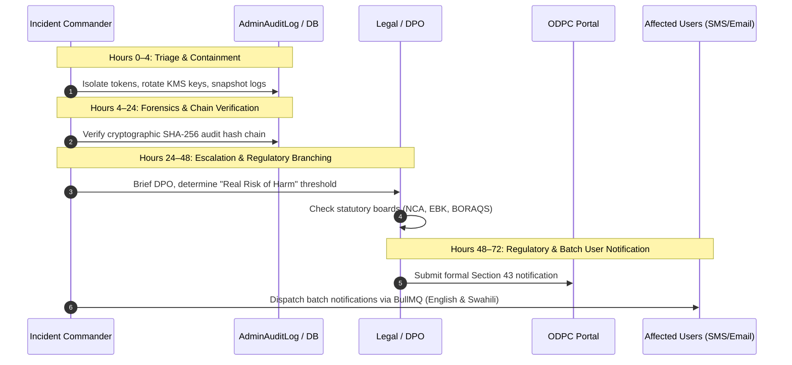

# 72-Hour Security Breach Response Playbook

**Document Status:** Approved Operational Playbook  
**Governing Statute:** Kenya Data Protection Act, 2019 (Section 43) • ADR-ADMIN-014  
**Evidence Date:** 2026-09-20  
**Owner:** Incident Response Operations  
**Next Review:** 2026-12-20

---

## 1. Statutory Obligation (DPA Section 43)

Section 43 of the Kenya Data Protection Act 2019 mandates:

> _Where personal data has been accessed or acquired by an unauthorized person, and there is a real risk of harm to the data subject whose personal data has been subjected to the breach, a data controller shall notify the Data Commissioner within seventy-two (72) hours of becoming aware of such breach._

This playbook outlines the exact hourly operational lifecycle, role delegations, forensic verification, and multi-regulator notification branching.

---

## 2. The 72-Hour Incident Lifecycle



### Hours 0–4: Triage, Severity Classification & Immediate Containment

1. **Appoint Incident Commander (IC):** Default is Founder / Acting DPO (Don Shammah). If unavailable, activate proxy per [`SOLO_FOUNDER_CONTINUITY_NOTE.md`](SOLO_FOUNDER_CONTINUITY_NOTE.md).
2. **Classify Incident Severity (ADR-ADMIN-014):**
   - **CRITICAL:** Exposure of Class A credentials, payment secrets, unmasked national IDs affecting > 50 users.
   - **HIGH:** Unauthorized access to contractor verification documents or masked homeowner contact queues.
   - **MEDIUM:** Rate-limit bypass with limited data scraping; transient database connection exposure without data egress.
   - **LOW:** Isolated failed brute-force attempt or minor non-PII error leak.
3. **Isolate Compromised Systems:**
   - Invalidate affected Clerk session tokens platform-wide.
   - Rotate AWS KMS database encryption keys if master credentials are in question.
   - Restrict database IP allowlists to emergency maintenance jump boxes.

### Hours 4–24: Forensics & Cryptographic Hash-Chain Verification

1. **Audit Trail Verification:**
   - Execute verification script on `AdminAuditLog`: assert $\text{hash}_n = \text{SHA256}(\text{hash}_{n-1} + \text{record}_n)$ to verify logs were not tampered with during the breach.
2. **Enumerate Affected Records & Data Classes:**
   - Query log correlation IDs to determine exactly how many user profiles, documents, or transactions were accessed.
3. **Statutory Risk Assessment:**
   - Evaluate whether the compromise creates a **real risk of harm** (identity theft, financial fraud, physical security risk to homeowners).

### Hours 24–48: Legal Escalation & Multi-Authority Branching

1. **DPO & Legal Counsel Briefing:**
   - Review forensic findings with external corporate legal counsel.
2. **Multi-Authority Notification Branching:**
   - **ODPC:** Primary statutory regulator for all personal data breaches.
   - **Statutory Professional Boards (NCA, EBK, BORAQS):** If contractor trade certificates or regulatory stamps were forged or exfiltrated, dispatch immediate advisory notices to the respective board registrar.
   - **Central Bank of Kenya (CBK):** If M-Pesa merchant credentials or B2C disbursement accounts were compromised, notify Safaricom fraud desk and CBK within required banking timelines.
3. **Draft Notifications:**
   - Prepare formal ODPC letter and localized user advisories.

### Hours 48–72: Regulatory Filing & Batch User Notification

1. **Submit Formal ODPC Notification:**
   - Dispatch via [dataportal.odpc.go.ke](https://dataportal.odpc.go.ke) and copy `info@odpc.go.ke` before the 72-hour mark.
2. **Trigger Automated User Notifications:**
   - Enqueue jobs to BullMQ `compliance-notifications` queue in `apps/workers`.
   - Dispatch emails (via Resend) and SMS (via Africa's Talking) in English and Swahili.

### Post-72 Hours: Remediation & Continuous Hardening

1. Seal forensic logs and archive incident record into `SecurityIncident` database table.
2. Publish post-mortem and update [`BREACH_TABLETOP_SIMULATION_RECORD.md`](BREACH_TABLETOP_SIMULATION_RECORD.md).

---

## 3. Pre-Approved Regulatory Notification Letter Template (ODPC)

```text
To: The Data Commissioner
Office of the Data Protection Commissioner (ODPC)
Britam Tower, 12th Floor, Upper Hill, Nairobi, Kenya
Email: info@odpc.go.ke

Date: [Insert Date within 72h window]
Subject: Formal Notification of Personal Data Incident pursuant to Section 43 of the Data Protection Act, 2019

Dear Commissioner,

Build Market Technologies Ltd, registered Data Controller/Processor [Insert Reg No], hereby submits formal notification of a personal data security incident detected on [Insert Detection Timestamp]:

1. Nature of the Incident: [Describe whether unauthorized access, exfiltration, or system compromise occurred]
2. Categories and Number of Data Subjects Affected: Approximately [Insert Number] registered [contractors/homeowners] in Kenya.
3. Categories of Personal Data Involved: [List: e.g., National ID documents, contact phone numbers, trade licenses]
4. Likely Consequences: [Assess risk of identity theft, unauthorized solicitation, or financial risk]
5. Mitigation Measures Taken: [List: Sessions invalidated, KMS keys rotated, access restricted, affected endpoints patched]
6. Designated Contact Officer: Don Shammah, Acting DPO (privacy@buildmarket.app | +254 700 000000)

Respectfully submitted,
Build Market Technologies Ltd
```

---

## 4. Bilingual User Notification Templates

### English Template (Email & In-App Notice)

> **Subject:** Important Notice Regarding Your Build Market Account Security
>
> Dear [User Name],  
> We are contacting you to inform you of a recent security incident that may have involved your Build Market account data. On [Date], our security monitoring detected unauthorized access affecting [describe specific data: e.g., your registered phone number and contractor license copy].
>
> **What We Did:** Our team contained the incident within 45 minutes, invalidated all active sessions, rotated encryption credentials, and notified the Office of the Data Protection Commissioner.
>
> **What You Should Do:** Please sign back into your account and verify your contact information. If you notice any suspicious correspondence or unsolicited calls claiming to be from Build Market, report them immediately to [safety@buildmarket.app](mailto:safety@buildmarket.app).

### Swahili Template (Barua Pepe & Notisi ya Ndani ya Programu)

> **Mada:** Notisi Muhimu Kuhusu Usalama wa Akaunti Yako ya Build Market
>
> Mpendwa [Jina la Mtumiaji],  
> Tunawasiliana nawe kukufahamisha kuhusu tukio la kiusalama lililotokea hivi majuzi ambalo huenda liliathiri data ya akaunti yako ya Build Market. Mnamo [Tarehe], mifumo yetu ya usalama ilitambua ufikiaji usioidhinishwa ulioathiri [taja data husika: mfano nambari ya simu na nakala ya cheti chako cha usajili].
>
> **Hatua Tulizochukua:** Timu yetu ilidhibiti hali hiyo ndani ya dakika 45, kufuta vipindi vyote vya sasa vya kuingia, kubadilisha funguo za usimbaji fiche, na kutoa taarifa rasmi kwa Ofisi ya Kamishna wa Kulinda Data (ODPC).
>
> **Unachopaswa Kufanya:** Tafadhali ingia tena kwenye akaunti yako na uhakiki maelezo yako. Ukigundua ujumbe au simu zozote za kutiliwa shaka, ripoti mara moja kwa [safety@buildmarket.app](mailto:safety@buildmarket.app).
