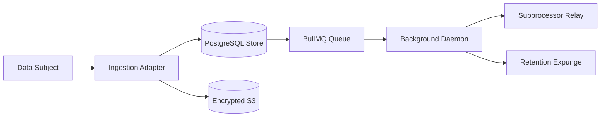

# Record of Processing Activities (ROPA)

**Document Status:** Approved Baseline  
**Governing Statute:** Kenya Data Protection Act, 2019 (Section 23) / GDPR Article 30  
**Evidence Date:** 2026-09-20  
**Owner:** Privacy & Compliance Engineering  
**Next Review:** 2026-12-20

---

## 1. Controller Details

- **Entity Name:** Build Market Technologies Ltd
- **Physical Address:** Nairobi, Kenya
- **Designated Privacy Officer:** Founder / Acting DPO (`privacy@buildmarket.app`)

---

## 2. Granular Processing Inventory & Per-Field Legal Basis

### Purpose 1: Builder Credentialing & Verification

- **Data Subjects:** Registered building contractors, artisans, architects, structural engineers.
- **Data Flow:** Web Onboarding Adapter (`/api/onboarding`) $\rightarrow$ Postgres `ProfessionalProfile` & S3 Document Bucket $\rightarrow$ NATS `verification.requested` $\rightarrow$ Background License Verification Worker $\rightarrow$ External Statutory Registers (NCA, EBK, BORAQS).

| Data Field                     | Classification | Lawful Basis (DPA §30)                    | Retention Period              | Storage Location      |
| ------------------------------ | -------------- | ----------------------------------------- | ----------------------------- | --------------------- |
| Full Legal Name                | Class B        | Contractual Necessity                     | Active account + 2 years      | PostgreSQL (`User`)   |
| National ID Number             | Class A        | Legal Obligation / Statutory Verification | Verification cycle + 1 year   | Encrypted PostgreSQL  |
| ID Card Document Photo         | Class B        | Legal Obligation (Anti-fraud)             | Active verification + 2 years | Encrypted AWS S3 / R2 |
| Statutory Reg Number (NCA/EBK) | Class B        | Public Interest / Contractual Necessity   | Public lifecycle of profile   | PostgreSQL            |
| Business GPS / County          | Class B        | Legitimate Interest (Local routing)       | Duration of listing           | PostgreSQL (GeoJSON)  |
| KRA Tax PIN                    | Class A        | Legal & Tax Obligation                    | 7 years (Tax Procedures Act)  | AES-256 Encrypted DB  |

### Purpose 2: Homeowner Matchmaking & Lead Routing

- **Data Subjects:** Property owners, project developers, commercial property managers.
- **Data Flow:** Intake Form (`/api/leads`) $\rightarrow$ Masking Engine $\rightarrow$ PostgreSQL `Lead` & `MarketplaceRoutingEvent` $\rightarrow$ Professional In-App Notification $\rightarrow$ Direct Match Disclosure upon Homeowner Proposal Acceptance.

| Data Field                     | Classification | Lawful Basis (DPA §30)      | Retention Period                     | Storage Location      |
| ------------------------------ | -------------- | --------------------------- | ------------------------------------ | --------------------- |
| Project Location (County/Ward) | Class B        | Contractual Necessity       | Active project + 1 year              | PostgreSQL            |
| Homeowner Phone Number         | Class B        | Explicit Consent & Contract | Masked; Retained 180d if unconverted | Encrypted DB (Masked) |
| Project Budget Estimate        | Class C        | Contractual Necessity       | Active project + 1 year              | PostgreSQL            |
| In-App Messages / Chat         | Class B        | Contractual Performance     | 3 years post-project                 | PostgreSQL            |

### Purpose 3: Financial Settlement & Transaction Accounting

- **Data Subjects:** Paying homeowners, verified professionals receiving platform leads.
- **Data Flow:** Daraja Callback (`/api/webhooks/mpesa`) $\rightarrow$ Idempotent Replay Verifier $\rightarrow$ PostgreSQL `MpesaTransaction` & `ProfessionalTransaction` $\rightarrow$ Financial Ledger.

| Data Field                    | Classification | Lawful Basis (DPA §30)                         | Retention Period             | Storage Location |
| ----------------------------- | -------------- | ---------------------------------------------- | ---------------------------- | ---------------- |
| M-Pesa Phone Number           | Class A        | Legal Obligation (Tax / Anti-Money Laundering) | 7 years (Tax Procedures Act) | PostgreSQL       |
| M-Pesa Transaction Receipt    | Class A        | Statutory Accounting Obligation                | 7 years                      | PostgreSQL       |
| Transaction Amount & Currency | Class C        | Legal Obligation                               | 7 years                      | PostgreSQL       |
| Platform Service Fee Ledger   | Class C        | Legal Obligation                               | 7 years                      | PostgreSQL       |

---

## 3. Categories of Recipients & International Transfers

1. **Internal Recipients:** Authorized Marketplace Operations and Verification Engineers (subject to role-based access control and Tier 1 authentication).
2. **Third-Party Subprocessors:** Clerk Inc. (Auth), Amazon Web Services (Storage), Neon Inc. (DB), Resend Inc. (Email), Safaricom PLC (Payments), Africa's Talking Ltd (SMS).
3. **Statutory & Regulatory Bodies:** Office of the Data Protection Commissioner (ODPC), Kenya Revenue Authority (KRA), National Construction Authority (NCA) upon lawful warrant or statutory reporting requirement.

---

## 4. Technical & Organizational Measures (TOMs) Summary

- **Confidentiality:** Mandatory Clerk multi-factor authentication for operators; transparent AES-256-GCM field encryption for Class A data; strict data minimization at API boundaries.
- **Integrity:** SHA-256 cryptographic hash-chaining on `AdminAuditLog`; append-only mutation tracking.
- **Resilience:** BullMQ background queues with exponential backoff and dead-letter queue isolation (ADR-ADMIN-012); hourly encrypted PostgreSQL WAL backups.
- **Data Portability & Erasure:** Fully automated self-service endpoints (`/api/user/export`, `/api/user/deletion`) supported by background worker processors.
