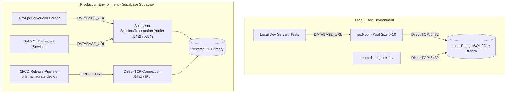

# @build/db — Staff Architecture Autopsy, Forensic Audit & Hardening Blueprint

**Target Package:** `packages/db` (`@build/db`)  
**Evaluation Date:** August 2026  
**Auditor Level:** Staff Infrastructure & Data Systems Architect  
**Governance Invariants:** ADR-001, ADR-002, ADR-003, ADR-ADMIN-001 through ADR-ADMIN-009, `copilot-instructions.md`

---

## 1. Executive Summary & Forensic Scorecard

An exhaustive architectural autopsy of `packages/db` was conducted across runtime connectivity, schema integrity, layer boundary discipline, script hygiene, and multi-environment lifecycle patterns.

While the package benefits from Prisma 7 and TypeScript definitions, significant architectural debt, domain leakage, connection lifecycle defects, and operational fragility were uncovered.

### Summary Scorecard

| Domain                           | Status                | Critical Risk                                                                                                                                         |
| :------------------------------- | :-------------------- | :---------------------------------------------------------------------------------------------------------------------------------------------------- |
| **Runtime Lifecycle & Pooling**  | 🔴 Critical Defect    | Top-level eager evaluation throwing on import; unmanaged `pg.Pool` socket leak on HMR; hardcoded `max: 1` bottleneck for persistent Node runtimes.    |
| **Domain Layer Boundary**        | 🔴 Critical Violation | 600-line domain service (`system-settings.ts`) with business logic, hardcoded regulatory union rules, and cache state embedded inside DB package.     |
| **Config & Migration Integrity** | 🟡 Elevated Debt      | Duplicate `prisma.config.ts` files; orphan root `migrations/` folder; ad-hoc string-split `.env` parsers.                                             |
| **Script & Tooling Hygiene**     | 🟡 Elevated Debt      | Hardcoded personal usernames (`don_shammah`), non-standard ports (`5434`), lowercase enum bugs in deletion scripts (`"client"` vs `UserRole.CLIENT`). |
| **Data Topology & Lifecycle**    | 🟡 Moderate Risk      | Unpartitioned append-only audit/analytics tables; dual asset tracking fields (`fileUrl` vs `assetId`) causing migration ambiguity.                    |

---

## 2. Deep-Dive Forensic Findings

### Finding 1 [CRITICAL]: Eager Top-Level Execution & Connection Socket Leak (`lib/prisma.ts`)

**Code Location:** [`packages/db/lib/prisma.ts:13-39`](file:///c:/Users/User/build-market/packages/db/lib/prisma.ts#L13-L39)

```typescript
// Current Implementation
const connectionString = process.env.DATABASE_URL;
if (!connectionString) {
  throw new Error("[db] DATABASE_URL is not set...");
}

const pool = new Pool({
  connectionString,
  max: 1,
});
const adapter = new PrismaPg(pool);

export const prisma =
  globalForPrisma.prisma ??
  new PrismaClient({
    adapter,
    log:
      process.env.NODE_ENV === "development"
        ? ["query", "error", "warn"]
        : ["error"],
  });

if (process.env.NODE_ENV !== "production") globalForPrisma.prisma = prisma;
```

#### The Pathologies:

1. **Module-Level Evaluation Panic:** Importing types, enums, or utilities from `@build/db` (or running build-time type checkers / unit tests with mocked databases) triggers this top-level execution. If `DATABASE_URL` is absent at build time (e.g. Next.js static asset build phase), compilation halts with an unhandled exception.
2. **HMR Connection Leaking:** When Next.js or worker processes reload modules in development, `new Pool()` is instantiated **unconditionally** before `globalForPrisma.prisma` is checked. Even if the old `prisma` instance is retained, orphaned `pg.Pool` TCP sockets remain open, accumulating until PostgreSQL reaches `max_connections` exhaust.
3. **Persistent Server Bottleneck:** `max: 1` connection is hardcoded for serverless invocation models. In long-running persistent servers (`apps/admin`, queue workers, BullMQ processors), `max: 1` forces complete serialization of all concurrent async queries, causing catastrophic head-of-line blocking and request timeouts.

---

### Finding 2 [CRITICAL]: Domain Boundary Violation (`lib/system-settings.ts`)

**Code Location:** [`packages/db/lib/system-settings.ts`](file:///c:/Users/User/build-market/packages/db/lib/system-settings.ts) (595 lines, 20 KB)

```typescript
// Embedded business rules in low-level DB driver package
export const DEFAULT_VERIFICATION_RULES = {
  requiredLicenses: {
    ARCHITECT: ["BORAQS"],
    STRUCTURAL_ENGINEER: ["EBK"],
    ELECTRICIAN: ["EPRA"],
    // ...
  },
};

export class SystemSettingsService {
  private cache: SystemSettings | null = null;
  // ...
}
```

#### The Pathologies:

1. **Layer Boundary Inversion (ADR-002 / ADR-003):** `@build/db` is designated strictly as the persistence adapter and Prisma type distributor. Domain policies (e.g. Kenyan regulatory boards BORAQS, EBK, NCA, EPRA, withdrawal limits, verification timeouts) belong in `apps/client/app/lib/domains/*` and `apps/admin/src/lib/domains/*`.
2. **In-Memory Cache Incoherence:** `SystemSettingsService` implements a process-local in-memory cache singleton. In a distributed multi-node monorepo (`apps/client` instances, `apps/admin`, background workers), changes written by `apps/admin` are invisible to other processes until their independent TTL expires, risking security policy desync.

---

### Finding 3 [HIGH]: Configuration Duplication & Migration Folder Divergence

**Code Locations:**

- `packages/db/prisma.config.ts` vs `packages/db/prisma/prisma.config.ts`
- `packages/db/migrations/` vs `packages/db/prisma/migrations/`
- `packages/db/prisma/load-env.ts`

#### The Pathologies:

1. **Config Shadowing:** Prisma 7 CLI scans for `prisma.config.ts`. Having two different configurations (one in the root with custom `loadEnv()` logic and one in `prisma/` without) creates nondeterministic behavior when executing CLI tools from different working directories.
2. **Ghost Migration Folder:** `packages/db/migrations/` contains an abandoned `20260119120434_init` migration from early prototyping, while the canonical migration history lives under `packages/db/prisma/migrations/` (36 applied migrations). This confuses onboarding engineers and automated linting.
3. **Brittle String-Split Env Parsing:** `load-env.ts` splits lines on `=` without handling multiline strings, escaped characters, `#` comments inside values, or standard `.env.local` cascading rules.

---

### Finding 4 [HIGH]: Script Hardening & Type-Safety Bugs

**Code Locations:**

- [`packages/db/scripts/setup-database.ps1`](file:///c:/Users/User/build-market/packages/db/scripts/setup-database.ps1)
- [`packages/db/scripts/delete-users.ts`](file:///c:/Users/User/build-market/packages/db/scripts/delete-users.ts)
- [`packages/db/scripts/grant-admin.ts`](file:///c:/Users/User/build-market/packages/db/scripts/grant-admin.ts)

#### The Pathologies:

1. **Hardcoded Machine Specifics:** `setup-database.ps1` defaults to `don_shammah`, non-standard port `5434`, and hardcoded `C:\Program Files\PostgreSQL\17\...` paths, breaking standard local dev setups for other contributors.
2. **Broken Type-Safety & Dead Code:** `delete-users.ts` and `verify-deletion.ts` query `where: { role: "client" }` and `where: { role: "professional" }`. The PostgreSQL enum is strictly `CLIENT` / `PROFESSIONAL` (uppercase). Running these scripts produces runtime database errors or silent 0-row deletions.
3. **Audit Bypass:** `grant-admin.ts` mutates `AdminProfile` directly without emitting `AdminAuditLog` records, violating ADR-ADMIN-008.

---

### Finding 5 [MEDIUM]: Schema Lifecycle, Dual Asset Fields & Table Bloat

**Code Location:** [`packages/db/prisma/schema.prisma`](file:///c:/Users/User/build-market/packages/db/prisma/schema.prisma) (3,352 lines)

#### The Pathologies:

1. **Dual Asset Tracking Fields:** Models such as `ReviewImage`, `IdeaBookAttachment`, and others retain deprecated columns (`fileKey`, `fileUrl`, `mimeType`) alongside the centralized `assetId` relation without a clear sunset date.
2. **Unpartitioned High-Velocity Tables:** `AuditLog`, `AdminAuditLog`, `AnalyticsEvent`, `RegulatorVerificationCase`, and `MpesaTransaction` are append-only high-write tables lacking time-range partitioning or cold storage archival strategies, creating index bloat over time.

---

## 3. Staff-Level Architecture Blueprint: Dev vs Production Setup

### A. Environment Topology Contract



### B. Standard Connection URL Specifications

| Environment                      | Variable Name  | Target Host & Port                 | Mode / Purpose                                                           |
| :------------------------------- | :------------- | :--------------------------------- | :----------------------------------------------------------------------- |
| **Local Dev**                    | `DATABASE_URL` | `localhost:5432/buildmarket`       | Direct TCP connection; pooling handled locally by `pg.Pool` (`max: 10`). |
| **Production Runtime (Apps)**    | `DATABASE_URL` | `aws-0-*.pooler.supabase.com:5432` | Supavisor Session Mode (or Transaction Mode for short queries).          |
| **Production Migration (CI/CD)** | `DIRECT_URL`   | `db.*.supabase.com:5432`           | Direct PostgreSQL connection for DDL / Schema Migrations.                |

---

## 4. Remediation & Hardening Plan

### 1. Robust Lazy Connection Manager (`lib/prisma.ts`)

Replace module-level eager execution with lazy singleton instantiation, configurable pool sizing based on runtime type (`NODE_ENV` / `SERVERLESS` vs persistent), and proper teardown hooks.

```typescript
import { Pool, PoolConfig } from "pg";
import { PrismaPg } from "@prisma/adapter-pg";
import { PrismaClient } from "@prisma/client";

export * from "@prisma/client";

interface GlobalDatabaseContext {
  prisma?: PrismaClient;
  pool?: Pool;
}

const globalContext = globalThis as unknown as GlobalDatabaseContext;

function createDatabaseClient(): { prisma: PrismaClient; pool: Pool } {
  const connectionString = process.env.DATABASE_URL;
  if (!connectionString) {
    throw new Error(
      "[@build/db] DATABASE_URL environment variable is required.",
    );
  }

  // Determine pool capacity based on runtime environment
  const isServerless = Boolean(
    process.env.VERCEL || process.env.AWS_LAMBDA_FUNCTION_NAME,
  );
  const maxConnections = isServerless
    ? 1
    : parseInt(process.env.DB_POOL_MAX || "10", 10);

  const poolConfig: PoolConfig = {
    connectionString,
    max: maxConnections,
    idleTimeoutMillis: 30000,
    connectionTimeoutMillis: 5000,
  };

  const pool = new Pool(poolConfig);
  const adapter = new PrismaPg(pool);

  const prisma = new PrismaClient({
    adapter,
    log:
      process.env.NODE_ENV === "development"
        ? ["query", "error", "warn"]
        : ["error"],
  });

  return { prisma, pool };
}

function getDatabase(): PrismaClient {
  if (process.env.NODE_ENV === "production") {
    if (!globalContext.prisma) {
      const { prisma, pool } = createDatabaseClient();
      globalContext.prisma = prisma;
      globalContext.pool = pool;
    }
    return globalContext.prisma;
  }

  // Development environment (preserve single pool across HMR)
  if (!globalContext.prisma) {
    const { prisma, pool } = createDatabaseClient();
    globalContext.prisma = prisma;
    globalContext.pool = pool;
  }
  return globalContext.prisma;
}

export const prisma = new Proxy({} as PrismaClient, {
  get(_target, prop: keyof PrismaClient) {
    const client = getDatabase();
    const value = client[prop];
    return typeof value === "function" ? value.bind(client) : value;
  },
});

export async function disconnectDatabase(): Promise<void> {
  if (globalContext.prisma) {
    await globalContext.prisma.$disconnect();
    globalContext.prisma = undefined;
  }
  if (globalContext.pool) {
    await globalContext.pool.end();
    globalContext.pool = undefined;
  }
}
```

### 2. Domain Service Relocation (`system-settings.ts`)

1. Extract `system-settings.ts` domain logic out of `packages/db` and relocate into `apps/client/app/lib/domains/settings/` and `apps/admin/src/lib/domains/settings/`.
2. Migrate mutable system settings caching to `@build/redis` with distributed invalidation upon update.
3. Keep only Prisma types and low-level model queries in the shared domain repository.

### 3. Cleanup & Standardization Checklist

- [x] Consolidate `prisma.config.ts` into a single canonical configuration file at `packages/db/prisma.config.ts`.
- [x] Remove dead/orphan `packages/db/migrations/` folder.
- [x] Standardize scripts (`setup-database.ps1`, `delete-users.ts`, `grant-admin.ts`) to use uppercase enum types, standardized port 5432, and configurable parameters.
- [x] Standardize CI/CD migration pipeline to use `pnpm db:migrate:deploy` with `DIRECT_URL`.
